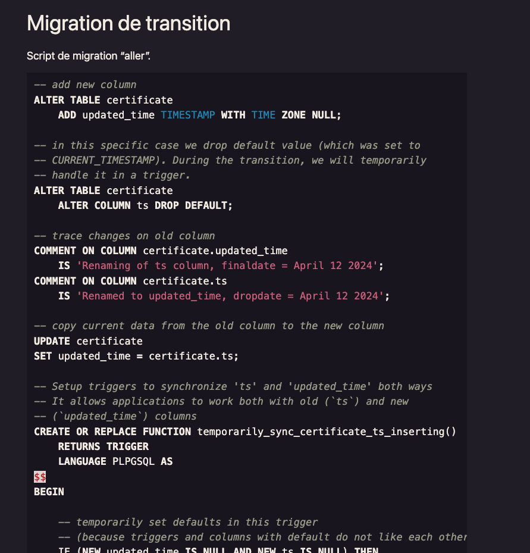
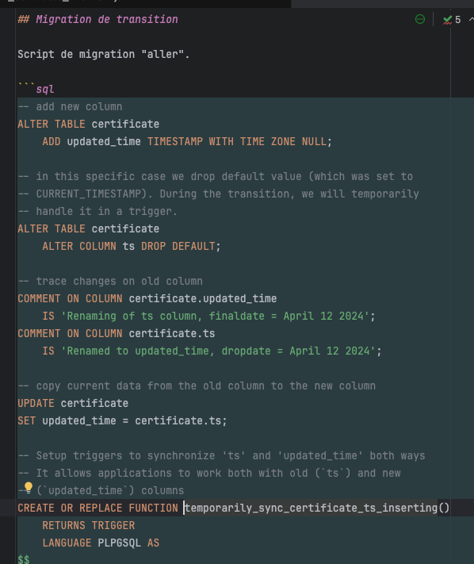
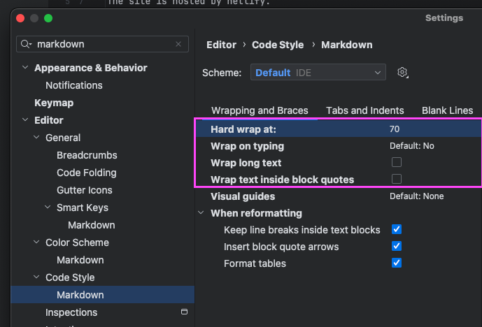

# iroco.co

Web site source of blog.iroco.co

The site is hosted by netlify.

## Writing

Recommendations

- [One sentence per line](https://asciidoctor.org/docs/asciidoc-recommended-practices/#one-sentence-per-line)
- On code snippet, add language (ex. "```js") to benefit from syntax coloration
- You can draw markdown diagram from code snippets with "```markdown".

## Editor line length

We recommend to set markdown line length to 70 characters in your editor.
This way, it will match snippets line length in rendered articles.

Example of rendered snippet :



The Markdown code of the page with line length set to 70 characters :



Jetbrains IDE markdown configuration sample.



- Hard wrap at : 70
- Wrap on typing : No
- Wrap long text : Unchecked
- Wrap text inside block quotes : Unchecked
