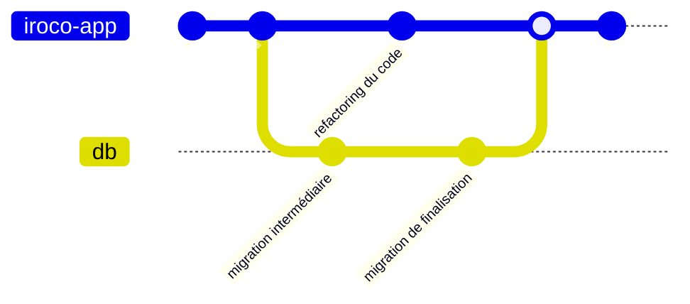

Si je veux faire une migration refactoring du nom de la colonne, il y a quelques précautions à prendre.

D'après le livre [Refactoring Databases Evolutionary Database Design](https://databaserefactoring.com/), il est préférable de créer la nouvelle colonne tout en maintenant l'ancienne et en synchronisant les données entre les 2 colonnes pendant une période de transition.



**Avant**


---

**Pendant la transition**


---

**Après**


---

## Refactoring de la colonne

Nom de la colonne à renommer : `ts`
Nouveau nom : `updated_time`

1. Introduire une nouvelle colonne `updated_time`
2. (optionnel) introduire un trigger de synchronisation pour copier les données de l'ancienne colonne vers la nouvelle (et permettre aux applications de continue de fonctionner)
3. (optionnel) renommer les autres colonnes (si le nom de la colonne est utilisé dans d'autres tables)

## Migration de transition

Script de migration "aller".

```sql
-- add new column
ALTER TABLE certificate
    ADD updated_time TIMESTAMP WITH TIME ZONE NULL;

-- in this specific case we drop default value (which was set to 
-- CURRENT_TIMESTAMP). During the transition, we will temporarily 
-- handle it in a trigger.
ALTER TABLE certificate
    ALTER COLUMN ts DROP DEFAULT;

-- trace changes on old column
COMMENT ON COLUMN certificate.updated_time
    IS 'Renaming of ts column, finaldate = April 12 2024';
COMMENT ON COLUMN certificate.ts
    IS 'Renamed to updated_time, dropdate = April 12 2024';

-- copy current data from the old column to the new column
UPDATE certificate
SET updated_time = certificate.ts;

-- Setup triggers to synchronize 'ts' and 'updated_time' both ways
-- It allows applications to work both with old (`ts`) and new 
-- (`updated_time`) columns
CREATE OR REPLACE FUNCTION temporarily_sync_certificate_ts_inserting()
    RETURNS TRIGGER
    LANGUAGE PLPGSQL AS
$$
BEGIN

    -- temporarily set defaults in this trigger 
    -- (because triggers and columns with default do not like each other
    -- that much)
    IF (NEW.updated_time IS NULL AND NEW.ts IS NULL) THEN
        NEW.ts := CURRENT_TIMESTAMP;
    END IF;

    IF NEW.updated_time IS NULL THEN
        NEW.updated_time := NEW.ts;
    END IF;

    IF NEW.ts IS NULL THEN
        NEW.ts := NEW.updated_time;
    END IF;

    RETURN NEW;
END;
$$;

CREATE OR REPLACE FUNCTION temporarily_sync_certificate_ts_updating()
    RETURNS TRIGGER
    LANGUAGE PLPGSQL AS
$$
BEGIN

    IF NEW.updated_time <> OLD.updated_time THEN
        NEW.ts = NEW.updated_time;
    END IF;

    IF NEW.ts <> OLD.ts THEN
        NEW.updated_time := NEW.ts;
    END IF;

    RETURN NEW;
END;
$$;

CREATE OR REPLACE TRIGGER TemporarilySynchronizeCertificateTsUpdate
    BEFORE UPDATE
    ON certificate
    FOR EACH ROW
EXECUTE FUNCTION temporarily_sync_certificate_ts_updating();

CREATE OR REPLACE TRIGGER TemporarilySynchronizeCertificateTsInsert
    BEFORE INSERT
    ON certificate
    FOR EACH ROW
EXECUTE FUNCTION temporarily_sync_certificate_ts_inserting();


```

Script de migration "retour arrière".

```sql
      ALTER TABLE certificate
    ALTER COLUMN ts SET NOT NULL;

ALTER TABLE certificate
    ALTER COLUMN ts SET DEFAULT CURRENT_TIMESTAMP;

DROP TRIGGER TemporarilySynchronizeCertificateTsInsert ON certificate;
DROP TRIGGER TemporarilySynchronizeCertificateTsUpdate ON certificate;
DROP FUNCTION temporarily_sync_certificate_ts_updating();
DROP FUNCTION temporarily_sync_certificate_ts_inserting();

ALTER TABLE certificate
    DROP COLUMN updated_time;
```

## Tester pendant la période de transition

Il est important de pouvoir tester notre migration afin de revenir en arrière si besoin.

Il ne faut pas oublier de tester la migration dans les 2 sens et avec des données.

Notre logiciel dispose de beaucoup de tests unitaires et de quelques tests d'intégration qui s'appuient sur une base de données de test.
Nous pouvons ainsi tester notre migration dans un environnement isolé et suffisamment réaliste.

Si nous avions joué la migration complète sans phase de transition, nous aurions des tests qui auraient échoué.


Or lors de la phase temporaire, les tests passent.


## Refactoring côté application

Comme nous avons un filet de test efficace, nous pouvons faire le refactoring du code de l'application.

Note : nous pourrions déployer la migration SQL intermédiaire indépendamment de celle du code.

`domain.ts`

```diff
--- a/src/domain.ts
+++ b/src/domain.ts
@@ -60,7 +60,7 @@
 	vdomain_id?: number
 	domain_name: string
 	chain: string
-	ts: Date
+	updated_time: Date
 }
 
 export type Certificate = CertificateSafe & {

```

En appliquant le refactoring sur l'objet domain dans le code typescript, je m'assure d'avoir coché search for text occurences.


Quand je lance l'aperçu, je me rends compte que le refactoring propose beaucoup trop de choses qui sont incorrectes. Il faudra qu'on les exclue du refactoring.


Pas de soucis! Je lance le refactoring qui a lieu en 2 temps.

Au final voici les refactorings que je garderai


Au format diff, ça donne :

```diff
Index: src/lib/server/repository.ts
IDEA additional info:
Subsystem: com.intellij.openapi.diff.impl.patch.CharsetEP
<+>UTF-8
===================================================================
diff --git a/src/lib/server/repository.ts b/src/lib/server/repository.ts
--- a/src/lib/server/repository.ts	(revision 03f8013483e2a17f117cbcfb0e49cec8b794f379)
+++ b/src/lib/server/repository.ts	(date 1712912688481)
@@ -64,7 +64,7 @@
 				'dkim_public_key',
 				'available',
 				'certificate.domain_name',
-				'certificate.ts',
+				'certificate.updated_time',
 				'certificate.chain'
 			)
 			.from<VirtualDomainSafe>('virtual_domain')
Index: src/domain.ts
IDEA additional info:
Subsystem: com.intellij.openapi.diff.impl.patch.CharsetEP
<+>UTF-8
===================================================================
diff --git a/src/domain.ts b/src/domain.ts
--- a/src/domain.ts	(revision 03f8013483e2a17f117cbcfb0e49cec8b794f379)
+++ b/src/domain.ts	(date 1712912688479)
@@ -60,7 +60,7 @@
 	vdomain_id?: number
 	domain_name: string
 	chain: string
-	ts: Date
+	updated_time: Date
 }
 
 export type Certificate = CertificateSafe & {
Index: src/lib/server/acmeClient.ts
IDEA additional info:
Subsystem: com.intellij.openapi.diff.impl.patch.CharsetEP
<+>UTF-8
===================================================================
diff --git a/src/lib/server/acmeClient.ts b/src/lib/server/acmeClient.ts
--- a/src/lib/server/acmeClient.ts	(revision 03f8013483e2a17f117cbcfb0e49cec8b794f379)
+++ b/src/lib/server/acmeClient.ts	(date 1712912688479)
@@ -46,6 +46,6 @@
 		domain_name: commonName,
 		skey: key.toString(),
 		chain: cert.toString(),
-		ts: DateTime.now().toJSDate()
+		updated_time: DateTime.now().toJSDate()
 	}
 }
Index: test/integration/admin/certs.spec.ts
IDEA additional info:
Subsystem: com.intellij.openapi.diff.impl.patch.CharsetEP
<+>UTF-8
===================================================================
diff --git a/test/integration/admin/certs.spec.ts b/test/integration/admin/certs.spec.ts
--- a/test/integration/admin/certs.spec.ts	(revision 03f8013483e2a17f117cbcfb0e49cec8b794f379)
+++ b/test/integration/admin/certs.spec.ts	(date 1712912688483)
@@ -105,7 +105,7 @@
 				domain_name: `${subdomainPrefix}.bar.com`,
 				chain: `${subdomainPrefix} cert`,
 				skey: `${subdomainPrefix} skey`,
-				ts: DateTime.now().toJSDate()
+				updated_time: DateTime.now().toJSDate()
 			})
 		}
 	})
@@ -198,7 +198,7 @@
 			domain_name: 'imap.foo.com',
 			skey: 'imap secret key',
 			chain: 'imap certificate',
-			ts: DateTime.now().toJSDate()
+			updated_time: DateTime.now().toJSDate()
 		})
 		expect(returnValue).toBeDefined()
 
@@ -206,14 +206,14 @@
 		expect(domain.certificates).toHaveLength(1)
 		expect(domain.certificates[0].domain_name)
 		    .toEqual('imap.foo.com')
 		expect(domain.certificates[0].chain)
 		    .toEqual('imap certificate')
-		expect(domain.certificates[0].ts).toBeDefined()
+		expect(domain.certificates[0].updated_time).toBeDefined()
 
 		await repository.saveCert({
 			vdomain_id: domain.id,
 			domain_name: 'smtp.foo.com',
 			skey: 'smtp secret key',
 			chain: 'smtp certificate',
-			ts: DateTime.now().toJSDate()
+			updated_time: DateTime.now().toJSDate()
 		})
 		domain = await repository.getDomainWithCertificates('foo.com')
 		expect(domain.certificates).toHaveLength(2)

```

## Autres impacts

Oups! j'ai oublié de faire un refactoring dans un script qui était dans un autre dépôt!

Pas de soucis, je suis encore en période de transition. Mes triggers compensent.

```diff
--- iroco-app-ansible/roles/letsencrypt/files/import_certificate.sh
+++ iroco-app-ansible/roles/letsencrypt/files/import_certificate.sh
@@ -20,0 +20,0 @@
SQL_REQUEST="INSERT INTO certificate 
    ( domain_name, vdomain_id, skey, chain, ts )
SELECT  
    '$SUBDOMAIN', virtual_domain.id, '$SKEY', '$CHAIN', '$ISO_CERT_DATE'
FROM  virtual_domain
WHERE virtual_domain.name = '$DOMAIN'
ON CONFLICT (domain_name)
DO UPDATE SET
   skey = '$SKEY',
   chain= '$CHAIN',
-   ts   = '$ISO_CERT_DATE'
+   updated_time   = '$ISO_CERT_DATE'
;"
 psql  -h localhost -U iroco iroco2 -c "$SQL_REQUEST"

```

## Fin de la période de transition

Maintenant que nous nous sommes assurés que les différentes applications qui utilisent cette colonne ont été mises à jour, nous pouvons terminer le refactoring.

```sql
-- Handle default value again  
alter table public.certificate
    alter column updated_time set default CURRENT_TIMESTAMP;
-- Now that we have a default value, we can set back the column as 
-- not null  
alter table public.certificate
    alter column updated_time set not null;
-- cleanup temporary functions and triggers  
DROP TRIGGER SynchronizeCertificateTsInsert ON certificate;
DROP TRIGGER SynchronizeCertificateTsUpdate ON certificate;
DROP FUNCTION temporarily_sync_certificate_ts_updating();
DROP FUNCTION temporarily_sync_certificate_ts_inserting();
--finally drop the old column  
ALTER TABLE certificate
    DROP COLUMN ts;
```
