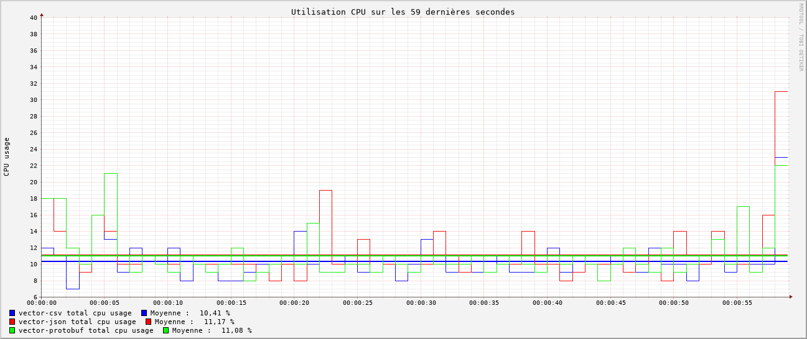
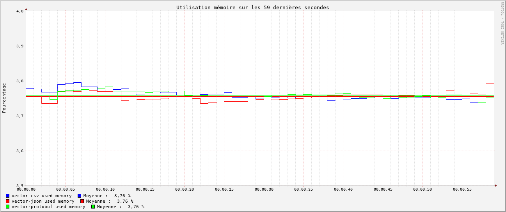
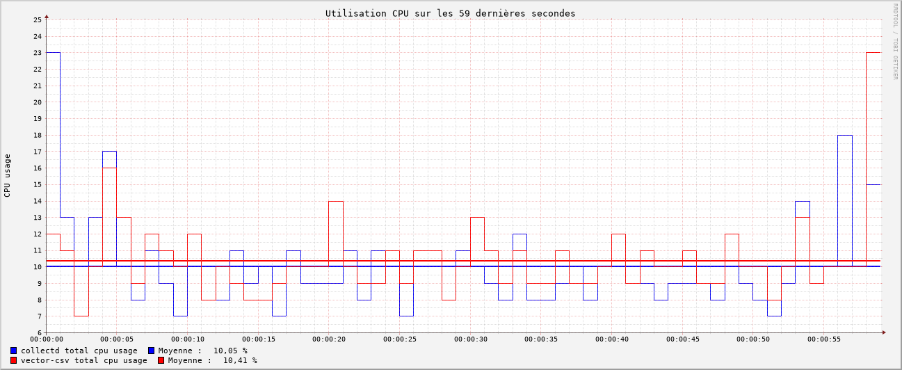
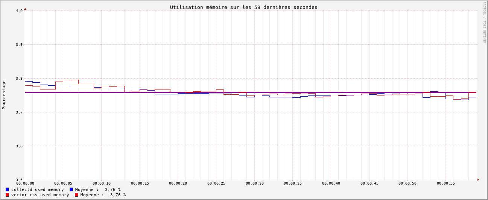
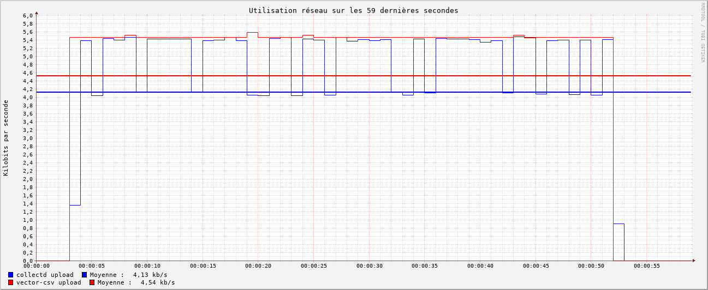

# Introduction
## Contexte et enjeux

Afin de faire évoluer le produit Iroco dans une optique de numérique durable et responsable, nous devons choisir un outil de monitoring qui sera la base de décisions structurelles à long terme. Ce choix n'est pas anodin, puisqu'il impactera directement l'avenir du développement de l'application. Notre démarche se fonde sur des critères objectifs et mesurables afin de garantir une décision éclairée.

## Les outils en compétition

Nous nous sommes concentrés sur deux solutions de monitoring :

- **Collectd** : Réputé pour sa légèreté et sa simplicité d'utilisation (*boring tech*).  
- **Vector** : Un outil plus récent et complet, offrant potentiellement plus de fonctionnalités (*hipe tech*).

## Objectifs du benchmark

Notre benchmark vise principalement à identifier l'outil le moins consommateur en ressources, dans le respect des enjeux écologiques. Pour cela, nous avons défini trois métriques clés, correspondant à l'impact environnemental mesuré sur :

- **CPU** : Pourcentage d'utilisation totale  
- **RAM** : Pourcentage d'utilisation totale  
- **Réseau** : Volume de données en upload (en KB)  

L'objectif est de tester chaque outil sur ces trois métriques afin de déterminer lequel offre le meilleur compromis entre performance et consommation.

## Démarche méthodologique

Afin de tester l'utilisation de l'outil de monitoring, nous devons simuler une situation d'utilisation réelle.

Nous avons donc lancé une instance observatrice de l'outil, un agent chargé de collecter et envoyer des données, ainsi qu'un agrégateur chargé de les recevoir. Nous avons choisi de réaliser le benchmark uniquement sur l'instance agent, car c'est celle qui devra être répliquée sur chaque machine et qui aura donc le plus d'impact sur la consommation globale.

### Mise en place du test

Pour réaliser ce benchmark, nous avons besoin de deux machines distinctes :  
1. Une pour les **agents**, sur laquelle sera effectué le benchmark.  
2. Une pour les **agrégateurs**, qui recevra les données envoyées.  

Nous ne cherchons pas introduire de la charge avec un injecteur, mais simplement à observer l'impact du collecteur de metrique sur la machine en relative isolation.
Nous avons choisi **rrdtool** pour l'historisation des données de bench collectées car il permet une collecte simple et très optimisée des données, minimisant ainsi son impact sur les résultats. De plus, il intègre un outil de génération de graphiques nativement.

### Conditions du test

Pour assurer l'équité des tests, les deux outils doivent réaliser des tâches aussi similaires que possible, en envoyant les mêmes informations à la même fréquence. Nous avons donc choisi d'envoyer les métriques suivantes :

- Utilisation CPU  
- Utilisation mémoire  
- Utilisation réseau  

Pour obtenir des résultats interprétables et identifier d'éventuelles fuites mémoire, nous avons décidé de tester les outils dans des conditions plus exigeantes que leur future utilisation en production. Ainsi, nous avons configuré l'envoi des métriques **une fois par seconde** lors des différents tests.

De plus, nous avons enregistré les données **5 secondes avant et 5 secondes après** chaque test afin d'observer l'impact du démarrage de l'outil sur les graphiques.

### Déroulement du benchmark

Pour assurer une évaluation rigoureuse et reproductible, nous avons mis en place un benchmark complet basé sur plusieurs scripts Bash :

- **Configuration des agents** : Deux scripts distincts configurent respectivement Collectd et Vector en tant qu'agents.  
- **Lancement des agrégateurs** : Deux scripts distincts exécutent et lancent Collectd et Vector en tant qu'agrégateurs (ces scripts doivent être lancés sur une autre machine).  
- **Collecte des données** : Un script dédié assure la collecte des métriques avec *rrdtool*.  
- **Génération des graphiques** :  
  - Un premier script génère des graphiques pour chaque métrique de chaque outil.  
  - Un second script superpose les courbes des deux outils pour une même métrique sur un seul graphique.  
- **Déroulé du benchmark** : Un script principal orchestre l'ensemble du processus, en enchaînant les étapes de configuration, de collecte et de génération des graphiques.  

Les graphiques ainsi générés offrent une visualisation claire des performances de chaque outil, facilitant l'analyse des résultats et la prise de décision finale.

---

# Vector

## Présentation

Vector est un framework de monitoring performant écrit en Rust. Il offre une très grande configurabilité et est compatible avec la plupart des nouvelles technologies (ex : Prometheus, Elasticsearch).

Il permet à la fois de collecter, filtrer, envoyer et agréger les données, ce qui en fait un outil très complet.

Nous avons également dû filtrer les données envoyées afin de ne transmettre que les informations pertinentes.

Nous avions l'intuition que cette forte configurabilité et ce grand nombre de fonctionnalités auront nécessairement un impact sur les performances.

## Configuration

Afin d'être au plus proche du fonctionnement de Collectd, nous avons configuré Vector pour une communication en UDP.

Nous devions également choisir un type d'encodage des données. Vector propose plusieurs options, et nous avons décidé de tester les performances de trois encodages standards : **CSV**, **Protobuf** et **JSON**.

## Résultats

Nous avons réalisé plusieurs tests afin de nous assurer de la cohérence des résultats.

### CPU

En ce qui concerne l'utilisation CPU, nous avons constaté une très faible différence entre les différents encodages, avec un léger avantage pour le format **CSV**, suivi de **Protobuf** et enfin **JSON**.

### Mémoire

En ce qui concerne l'utilisation mémoire, nous n'avons pas observé de différence significative entre les formats.

### Réseau

Concernant l'utilisation réseau, nous avons observé une différence significative entre les formats. Le format **CSV** est celui qui consomme le moins de bande passante, suivi de près par **Protobuf**. Le format **JSON**, en revanche, consomme près de **trois fois plus** de bande passante que les deux autres.

### Conclusion

Pour la configuration de Vector, le format **CSV** semble être le plus économe en bande passante et le plus performant en termes d'utilisation CPU. De plus, il est très simple à configurer et à utiliser, comparé à **Protobuf**, qui arrive en deuxième position.

---

# Collectd

## Présentation

Collectd est un outil de monitoring très léger et simple d'utilisation. Il est largement utilisé dans le monde de l'open source et bénéficie d'une documentation complète. Écrit en C, il est particulièrement performant tout en restant facile à configurer et à utiliser.

## Configuration

La configuration de Collectd est plus simple que celle de Vector. Il utilise son propre système d'encodage de données, optimisé pour la performance. Les seules configurations nécessaires ont été de choisir les types de données à envoyer ainsi que l'intervalle d'envoi des données (1 par seconde).

## Résultats

Nous avons réalisé plusieurs tests afin de nous assurer de la cohérence des résultats.

### CPU

Concernant l'utilisation CPU, nous avons observé une faible différence entre Collectd et Vector en format CSV, avec un avantage pour **Collectd**, qui reste plus performant.

### Mémoire

Concernant l'utilisation mémoire, nous n'avons pas observé de différence significative entre les deux outils.

### Réseau

Concernant l'utilisation réseau, nous avons observé une différence significative entre les deux outils. **Collectd consomme beaucoup moins de bande passante que Vector en moyenne.**  
Cela s'explique par le fait que Collectd envoie des paquets plus volumineux, contenant plus de données par paquet, mais à une fréquence moins élevée que Vector. Ce mode de fonctionnement rend le protocole plus économe en bande passante.

### Conclusion

Collectd s'avère être le plus performant en termes d'utilisation CPU et de bande passante. Il est également très simple à configurer et à utiliser.  
C'est donc **le choix le plus adapté** pour notre application, qui ne nécessite pas de fonctionnalités avancées de monitoring. **Collectd incarne l'efficacité et la simplicité.**
