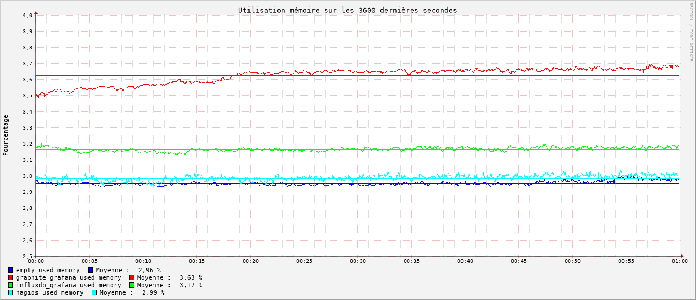

# Conclusion

## Graphiques de performance

Chaque graphique ci-dessous représente la moyenne des mesures prises toutes les secondes sur une période de 3600 secondes pour chaque outil de monitoring, soit approximativement **1h00** . Les mesures sont comparées à une mesure témoin prise sans aucun outil de monitoring en fonctionnement (*empty*).

### CPU

On observe que **Zabbix** est l'outil le plus gourmand en CPU, et de loin avec une moyenne de **151%** d'utilisation. **Nagios** et **Graphite + Grafana** sont beaucoup moins gourmands avec une moyenne de **23%** d'utilisation CPU pour **Nagios**, **16%** pour **Graphite + Grafana** et **11,12** pour **Influxdb + Grafana**. Sachant que la mesure témoin donne **9,5%** d'utilisation sans outils en fonctionnement, cela nous donne une approximation à:
  - **Zabbix** : **141,5%** d'utilisation CPU
  - **Nagios** : **13%** d'utilisation CPU
  - **Graphite + Grafana** : **6,5%** d'utilisation CPU
  - **Influxdb + Grafana** : **1,5%** d'utilisation CPU

### RAM

Concernant la RAM, **Zabbix** est encore l'outil le plus gourmand avec une moyenne de **4,17%** d'utilisation RAM. La différence est moins marquée que pour l'utilisation CPU avec **Nagios** à **2,99%**, **Graphite + Grafana** à **3,63%** et **Influxdb + Grafana** à **3,17** d'utilisation RAM. La mesure témoin donne **2,96%** d'utilisation sans outils en fonctionnement, ce qui nous donne une
approximation à:
  - **Zabbix** : **1,21%** d'utilisation RAM
  - **Nagios** : **0,03%** d'utilisation RAM
  - **Graphite + Grafana** : **0,67%** d'utilisation RAM
  - **Influxdb + Grafana** : **0,21%** d'utilisation RAM

## Tableau récapitulatif des observations

| Outil | Compatibilité avec Collectd | Type de configuration | Technologie de Stockage | Technologie de visualisation | Interface | Performances | Système d'alerte | OpenSource | Facilité de déploiement* |
|------------|---------|---------|-------------|-----------|----------|---|---|---|---|
|**Nagios**| Compliqué avec Collectd-Nagios | Complexe, Fichiers de conf | rrd | Nagiosgraph -> rrdgraph | Ancienne, peu intuitive | Très bonnes | Oui, non testé | Partiellement, plugins payants (Icnga -> Fork OpenSource) | Nombreuses dépendances, pas de rôle ansible récent |
|**Zabbix**| Compliqué avec Zabbix-Sender | Moyen-Simple, Base de donnée | choix: mysql/postgresql | Zabbix | Moderne, moyennement intuitive | Moyennes | Oui, testé | Oui| Quelques dépendances, rôle ansible à jour |
|**Graphite + Grafana**| Natif | Simple, Base de donnée + fichiers de conf  | whisper | Grafana | Moderne, intuitive | Bonnes | Oui, testé | Oui| Beaucoup de dépendances, rôle ansible non à jour pour graphite et à jour pour grafana |
|**Influxdb V1 + Grafana**| Natif pour la V1 | Simple, Base de donnée + fichiers de conf | Influxdb | Grafana | Moderne, intuitive | Très Bonnes | Oui, testé | Oui | Simple, rôle ansible à jour pour grafana, non nécessaire pour influxdb V1 |

*_Facilité de déploiement: automatisable avec ansible, reproductible, nombre de dépendances_

## Tableau récapitulatif des points forts et faibles selon no critères

|Outil | points forts | points faibles |
|---|---|---|
| **Nagios** | 🟢 Très Bonnes performances   🟢 Outil Approuvé | 🔴 Configuration complexe   🔴 Interface vieillissante   🔴 N'est pas compatible avec collectd nativement   🔴 Documentation éparpillée   🔴 N'est pas totalement OpenSource |
| **Zabbix** | 🟢 Interface moderne   🟢  Documentation complète   🟢  Plutôt simple à configurer   🟢  Configuration | 🔴 Performances moyennes   🔴 N'est pas compatible avec collectd nativement   🔴 La configuration et les données sont stockées dans la mème bdd |
| **Graphite + Grafana** | 🟢 Interface moderne   🟢  Simple à configurer et à prendre en main   🟢  Compatible avec collectd nativement (Permet l'exploration automatique des métriques disponibles)   🟢  Modularité (Découplage stockage des données et génération de graphs) | 🔴 Performances moins bonne que nagios   🔴  Nécessite deux outils pour fonctionner   🔴 Nombreuses dépendances pythons, rend l'installation compliquée|
| **Influxdb V1 + Grafana** | 🟢 Interface moderne   🟢  Simple à configurer et à prendre en main   🟢  Compatible avec collectd nativement (Permet l'exploration automatique des métriques disponibles)   🟢  Modularité (Découplage stockage des données et génération de graphs)   🟢  Très bonnes performances   🟢  Pas de dépendances|  🔴  Nécessite deux outils pour fonctionner   🔴  Quelques doutes sur la maintenance de la V1 sur le long terme|

Retrouvez les autres articles de cette série (à venir dans les prochains jours) :

- [Benchmark monitoring - Agents](/monitoring-agents/)
- [Benchmark monitoring - Introduction](/monitoring-introduction/)
- [Benchmark monitoring - Nagios](/monitoring-nagios/)
- [Benchmark monitoring - Zabbix](/monitoring-zabbix/)
- [Benchmark monitoring - Graphite + Grafana](/monitoring-graphite/)
- [Benchmark monitoring - InfluxDB + Grafana](/monitoring-influxdb)
