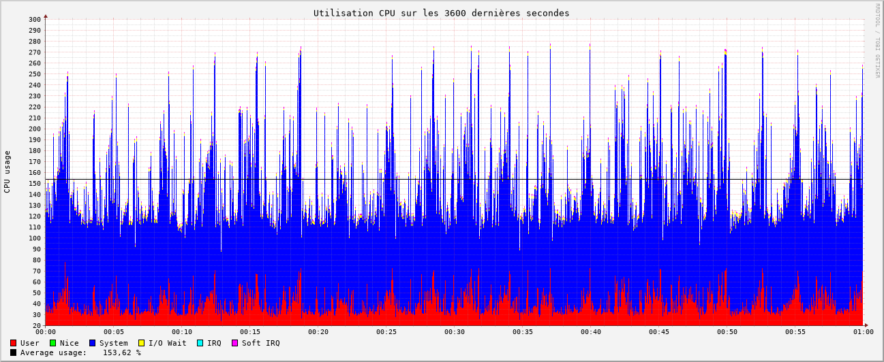

# Zabbix

## Présentation

  - **Description** : Zabbix est un outil open source d’entreprise doté d’une architecture distribuée (agents, proxies) et d’une base de données (MySQL/PostgreSQL/Oracle) pour stocker les métriques. Il fournit une interface moderne et un grand nombre de fonctionnalités relatives au monitoring. 
  - **Docker** : Il existe un docker compose officiel de Zabbix qui permet de déployer facilement Zabbix avec une base de données MySQL ou PostgreSQL. Il est disponible sur [Github](https://github.com/zabbix/zabbix-docker).

## Structure

  - [**Zabbix-server**](https://www.zabbix.com/documentation/7.2/en/manual/appendix/config/zabbix_server) : Noyau central qui gère la gestion des métriques, les utilisateurs et le système d'alerte.
  - **Mysql/PostgreSQL** : Base de données utilisée pour stocker les métriques et la configuration de Zabbix.
  - [**Zabbix-Web-Interface**](https://hub.docker.com/r/zabbix/zabbix-web-service) : Interface web pour visualiser l'état des services et hôtes, ainsi que de configurer Zabbix. C'est également lui qui génère les graphiques.
  - [**zabbix-sender**](https://www.zabbix.com/documentation/current/en/manpages/zabbix_sender) : Un utilitaire tiers qui permet d'envoyer des données à Zabbix en utilisant le protocole Zabbix trapper. Il est utilisé pour intégrer Collectd avec Zabbix. Nécessite le script **zabbix-sender.sh** pour récupérer les métriques de Collectd et les envoyer à formater pour **zabbix-sender**.

## Configuration
- **Interface Web / BDD** :
  - [**Data Collection/Hosts**](http://localhost/zabbix.php?action=host.list) : J'ai du créer un hôte pour mon serveur de test.
  - **Data Collection/Hosts/items** : J'ai du créer des items pour chaque métrique que je voulais surveiller (CPU, RAM, Réseau). J'ai du configurer chaque item pour qu'il utilise le type de données **Zabbix trapper** et le type de données **Collectd**. Cela permet à Zabbix de collecter les données envoyées par Collectd.
  - [**Dashboard**](http://localhost/zabbix.php?action=dashboard.view): J'ai créé un graph par groupe de métriques (CPU, RAM, Réseau; Disk File) pour visualiser les données collectées par Collectd. J'ai du configurer chaque graphique pour qu'il utilise les items que j'ai créés précédemment.
- **Utilitaire tiers**: 
  - J'ai du installer l'utilitaire [**zabbix-sender**](https://www.zabbix.com/documentation/current/en/manpages/zabbix_sender) pour envoyer les données de Collectd à Zabbix. Cet utilitaire permet d'envoyer des données à Zabbix en utilisant le protocole Zabbix trapper.
- **Création de script**:
  - Il m'a également été nécessaire de créer un script [**zabbix-sender.sh**](https://github.com/iroco-co/bench-monitoring-dashboard/blob/main/src/zabbix-sender.sh) qui convertit les données de Collectd en un format que [**zabbix-sender**](https://www.zabbix.com/documentation/current/en/manpages/zabbix_sender) peut comprendre. Ce script est exécuté par collectd à chaque fois que les datas sont mesurés et fait appel [**zabbix-sender**](https://www.zabbix.com/documentation/current/en/manpages/zabbix_sender).

## Résultats

### Observations 
  Une première observation est qu'il n'existe pas de solution simple pour intégrer Collectd et zabbix. Cependant, il existe un utilitaire, [**zabbix-sender**](https://www.zabbix.com/documentation/current/en/manpages/zabbix_sender), qui permet d'envoyer des données de Collectd à Zabbix. Cela nécessite une configuration supplémentaire et le développement d'un script pour convertir les données de Collectd en un format que Zabbix peut comprendre. Cependant, cela permet d'utiliser Collectd pour surveiller les hôtes et les services dans Zabbix. La configuration de zabbix doit être modifiée à chaque ajout de variable observée dans Collectd.

### Performances
  - **CPU** : 
    
    - Zabbix semble être très gourmand en CPU. On observe de très fortes variations de l'utilisation du CPU, avec des pics à plus de 200% d'utilisation. La moyenne d'utilisation du CPU est de **160%**.
  - **RAM** :
    
    - Zabbix semble être peu gourmand en RAM. On observe une utilisation moyenne de **4,67%** de la RAM. Cependant, on observe une légère augmentation de l'utilisation de la RAM au fil du temps, ce qui peut être dû à la gestion des données dans la base de données. Cela pourrait causer des problèmes de performance à long terme.

### Conclusion

Zabbix est un outil de monitoring complet et moderne, mais il est gourmand en CPU. Il nécessite une configuration supplémentaire pour intégrer Collectd, ce qui peut être une difficulté supplémentaire en ce qui concerne la maintenabilité. Mis à part cela, Zabbix reste plutôt simple à configurer. Il offre une interface web moderne et une grande flexibilité dans la configuration des graphiques et des alertes. Il est compatible avec les bases de données MySQL et PostgreSQL, ce qui permet de stocker les données de manière efficace. Il faudra cependant veiller à la gestion de la mémoire à long terme pour éviter les problèmes de performance. Zabbix est entièrement open-source, ce qui est un bon point selon nos critères.