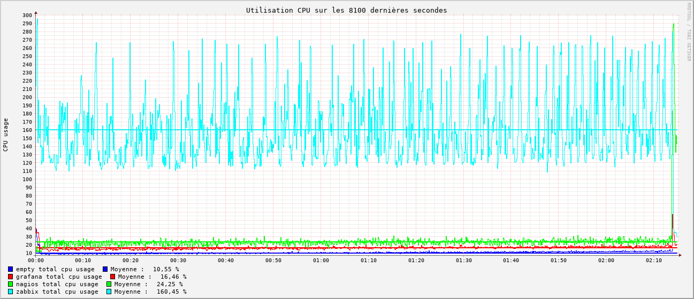
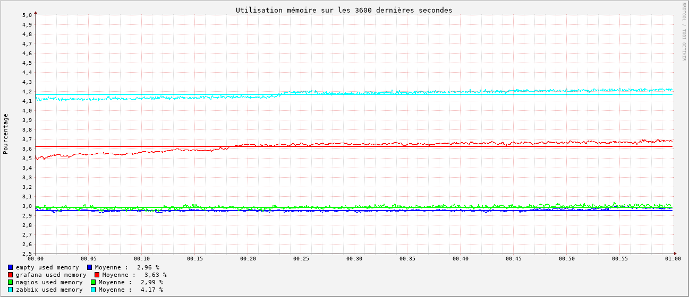

# Conclusion

## Graphiques de performance

Chaque graphique ci-dessous représente la moyenne des mesures prises toutes les secondes sur une période de 8100 secondes pour chaque outil de monitoring, soit approximativement **2h20** . Les mesures sont comparées à une mesure témoin prise sans aucun outil de monitoring en fonctionnement.
### CPU

- On observe que **Zabbix** est l'outil le plus gourmand en CPU, et de loin avec une moyenne de **160%** d'utilisation. **Nagios** et **Graphite + Grafana** sont beaucoup moins gourmands avec une moyenne de **24%** d'utilisation CPU pour **Nagios** et **16%** pour **Graphite + Grafana**. Sachant que la mesure témoin donne **10%** d'utilisation sans outils en fonctionnement, cela nous donne une approximation à:
  - **Zabbix** : **150%** d'utilisation CPU
  - **Nagios** : **14%** d'utilisation CPU 
  - **Graphite + Grafana** : **6%** d'utilisation CPU
  
### RAM

- Concernant la RAM, **Zabbix** est encore l'outil le plus gourmand avec une moyenne de **4,67%** d'utilisation RAM. La différence est moins marquée que pour l'utilisation CPU avec **Nagios** à **3,52%** et **Graphite + Grafana** qui a une moyenne de **3,88%** d'utilisation RAM. La mesure témoin donne **3,51%** d'utilisation sans outils en fonctionnement, ce qui nous donne une
approximation à:
  - **Zabbix** : **1,59%** d'utilisation RAM
  - **Nagios** : **0,01%** d'utilisation RAM 
  - **Graphite + Grafana** : **0,44%** d'utilisation RAM
## Tableau récapitulatif des observations

| Outil | Compatibilité avec Collectd | Type de configuration | Technologie de Stockage | Technologie de visualisation | Interface | Performances | Système d'alerte | OpenSource |
|------------ |---------|---------|-------------|-----------| ----------|---|---|---|
|**Nagios**| Compliqué avec Collectd-Nagios | Complexe, Fichiers de conf | rrd | Nagiosgraph -> rrdgraph | Ancienne, peu intuitive | Très bonnes | Oui, non testé | Partiellement, plugins payants (Icnga -> Fork OpenSource) |
|**Zabbix**| Compliqué avec Zabbix-Sender | Moyen-Simple, Base de donnée | choix: mysql/postgresql | Zabbix | Moderne, moyennement intuitive | Moyennes | Oui, testé | Oui|
|**Graphite + Grafana**| Natif | Simple, Base de donnée + fichiers de conf  | whisper | Grafana | Moderne, intuitive | Bonnes | Oui, testé | Oui|

## Tableau récapitulatif des points forts et faibles

|Outil | points forts | points faibles |
|---|---|---|
| **Nagios** | 🟢 Très Bonnes performances   🟢 Outil Approuvé | 🔴 Configuration complexe   🔴 Interface vieillissante   🔴 N'est pas compatible avec collectd nativement   🔴 Documentation éparpillée   🔴 N'est pas totalement OpenSource | 
| **Zabbix** | 🟢 Interface moderne   🟢  Documentation complète   🟢  Plutôt simple à configurer   🟢  Configuration | 🔴 Performances moyennes   🔴 N'est pas compatible avec collectd nativement   🔴 La configuration et les données sont stockées dans la mème bdd |
| **Graphite + Grafana** | 🟢 Interface moderne   🟢  Simple à configurer et à prendre en main   🟢  Compatible avec collectd nativement (Permet l'exploration automatique des métriques disponibles)   🟢  Modularité (Découplage stockage des données et génération de graphs) | 🔴 Performances moins bonne que nagios   🔴  Nécessite deux outils pour fonctionner|