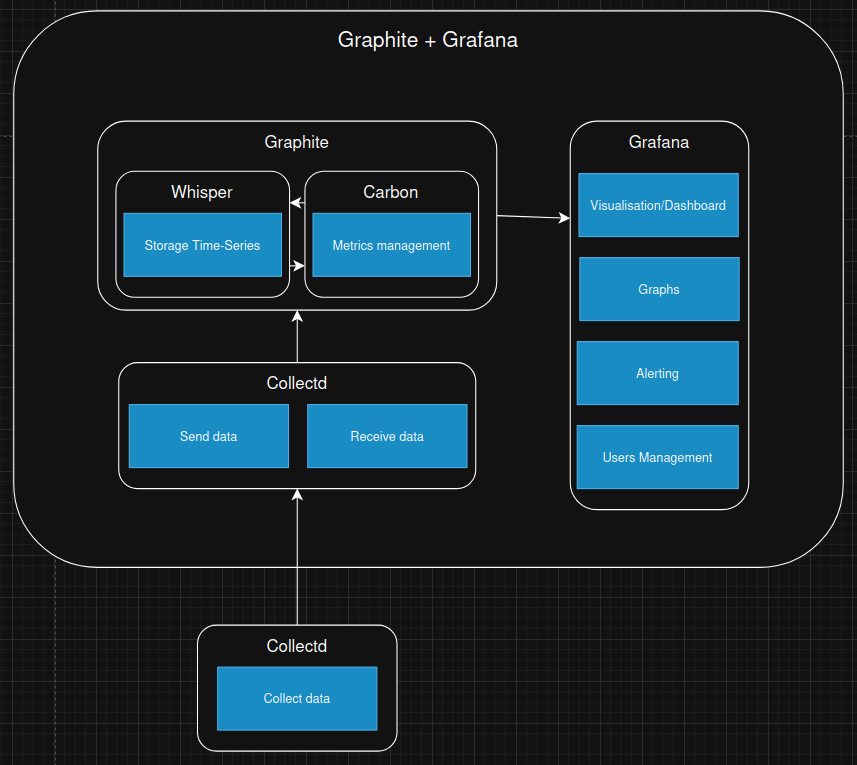
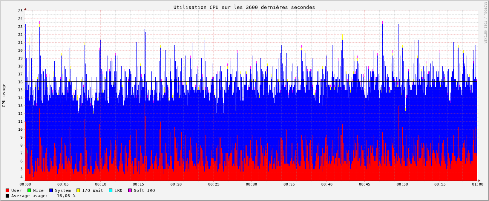

# Graphite + Grafana

## Présentation

### [Graphite](https://graphiteapp.org/)

**Description** : Conçu en 2006 pour collecter, stocker (via Whisper) et visualiser des séries temporelles de données grâce à Carbon et une interface web Graphite-Web graphite est un logiciel open-source plutôt modulaire (on peut changer whisper par d'autres technos si besoin). Il est compatible avec un grand nombre de logiciels différents (Icinga, Zabbix, Grafana, etc) mais reste cependant limité dans ses capacités avec sa configuration de base (pas d'alerting) et son interface web est vieillissante.

**Docker** : Il existe une image docker officiel de Graphite. Elle est disponible sur [Github](https://github.com/graphite-project/docker-graphite-statsd)

### [Grafana](https://grafana.com/)

**Description** : Grafana est une plateforme de représentation graphique de données statistiques libre de droit, lancée en 2013. Elle peut être facilement combinée à Graphite pour fournir une interface web moderne et simple d'utilisation, tout en comblant ses lacunes et terme de fonctionnalités.

**Docker** : Il existe une image docker officiel de Grafana version open-source. Elle est disponible sur [Docker hub](https://hub.docker.com/r/grafana/grafana-oss).

## Structure

- [**Graphite**](https://graphiteapp.org/) : Logiciel de stockage et de gestion de données temporelles modulaire.
- [**Carbon**](https://graphite.readthedocs.io/en/latest/carbon-daemons.html) : Composant principale de [**Graphite**](https://graphiteapp.org/) permettant la reception et la gestion des métriques collectées. Sa compatibilité avec **collectd** nous permet de nous passer d'utilitaire externe.
- [**Whisper**](https://graphite.readthedocs.io/en/latest/whisper.html) : Composant de [**Graphite**](https://graphiteapp.org/) fournissant le stockage de données temporelles. (peut être remplacé par d'autres technologies si besoin)
- [**Grafana**](https://grafana.com/) : Plateforme de représentation graphique fournissant une interface web moderne, la génération de graphique, l'alerting et la gestion des utilisateurs. Il se plug directement sur graphite ce qui lui permet d'observer les données collectées par ce dernier.

## Configuration

### Fichiers de configuration

- [**/opt/graphite/conf/storage-schemas.conf** (Graphite)](https://github.com/iroco-co/bench-monitoring-dashboard/blob/main/graphite/conf/storage-schemas.conf) : Fichier de configuration des schémas de stockage pour la configuration de la gestion de la rétention des données envoyées par Collectd.
- [**docker-compose.yaml**](https://github.com/iroco-co/bench-monitoring-dashboard/blob/main/docker-compose.yaml) : Docker compose pour lancer graphite, Grafana avec un Docker-Network pour la communication.

### Interface Web / BDD (Grafana)

**Data Source** : Nous avons ajouté une source de données Graphite dans Grafana. Cela permet à Grafana de se connecter à Graphite et d'explorer les données envoyées par Collectd.

**Dashboard** : Nous avons créé un dashboard pour visualiser les données collectées par Collectd. Nous avons ensuite créé chaque graphique pour qu'il utilise les données envoyées par Collectd. Grafana permet d'explorer automatiquement les métriques disponibles dans Graphite, ce qui simplifie grandement la création de graphiques.

## Résultats

### Observations

Une première observation est que Graphite et Collectd sont compatibles. En effet, Collectd peut directement envoyer des données à Graphite grace au plugin **write_graphite** . Cela permet d'utiliser Collectd pour surveiller les hôtes et les services dans Graphite. Graphite explore les données envoyées par Collectd et les affiche dans son interface web. Il est nécessaire de configurer chaque graphique manuellement.

### Performances

#### CPU

Graphite + Grafana semble être peu gourmand en CPU. On observe une utilisation moyenne de **16%** de celui-ci. De plus, son utilisation est stable dans le temps malgré une légère augmentation.

#### RAM

Graphite + Grafana semble être peu gourmand en RAM. On en observe une utilisation moyenne de **3,88%**. De plus, son utilisation est stable dans le temps malgré une très légère augmentation dans la durée.

### Conclusion

Graphite + Grafana est une solution de monitoring moderne et simple à configurer. Elle est compatible avec Collectd, ce qui permet de collecter facilement des données et de les explorer directement depuis l'interface. Son interface web est moderne et intuitive, ce qui facilite la création de graphiques et la gestion des utilisateurs. De plus, elle offre de bonnes performances en termes de consommation CPU et RAM. Cependant, elle nécessite deux outils pour fonctionner (Graphite et Grafana), ce qui peut compliquer la configuration initiale mais cela permet une forte modularité à cette solution (compatible avec Icinga2 ou Zabbix pour de futures évolutions). Graphite + Grafana est entièrement open-source, ce qui est un bon point selon nos critères.

Retrouvez les autres articles de cette série (à venir dans les prochains jours) :

- [Benchmark monitoring - Agents](/monitoring-agents/)
- [Benchmark monitoring - Introduction](/monitoring-introduction/)
- [Benchmark monitoring - Nagios](/monitoring-nagios/)
- [Benchmark monitoring - Zabbix](/monitoring-zabbix/)
- [Benchmark monitoring - InfluxDB + Grafana](/monitoring-influxdb)
- [Benchmark monitoring - Conclusion](/monitoring-conclusion/)
