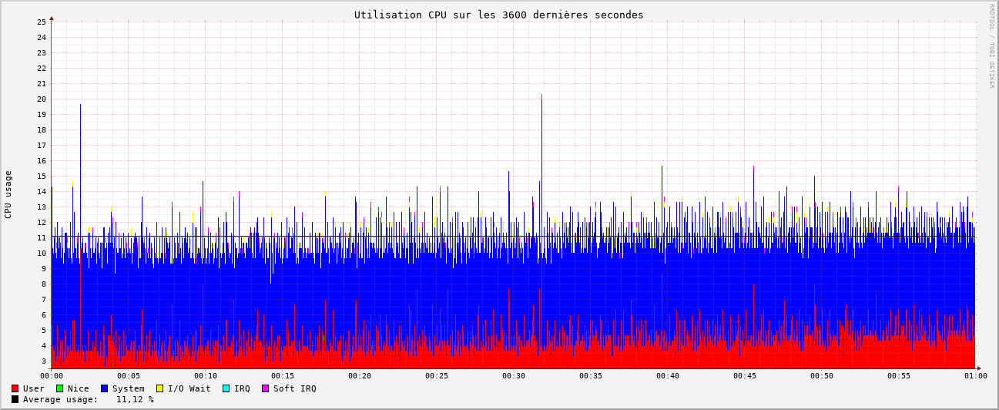
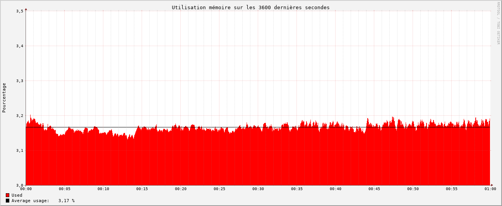

# InfluxDB

Après avoir rédigé notre série d'articles sur nos benchmarks des outils de monitoring, nous avons voulu mettre notre prototype Graphite + Grafana sous [ansible](https://www.redhat.com/en/ansible-collaborative).  

Malheureusement, Graphite est un système composé de plusieurs composants, chacun ayant ses propres dépendances Python. Nous n'avons pas trouvé de rôles Ansible récents (moins de 6 ans) et malgré plusieurs tentatives de mises à jour manuelles, nous avons rencontré de nombreux problèmes de compatibilités Python.  

C’est en cherchant des alternatives à Graphite, compatibles avec Collectd et Grafana, que nous nous sommes penchés sur [InfluxDB](https://www.influxdata.com/).  

## Présentation

**Description** : InfluxDB est une base de données temporelle (time-series database) conçue en 2013 et optimisée pour la rapidité.  
Il en existe aujourd'hui trois versions gratuites open source, chacune ayant sa version entreprise.  
- [InfluxDB V1](https://docs.influxdata.com/influxdb/v1/), écrite en **Go** est compatible nativement avec Collectd (sans intermédiaire) et n’intègre pas d’interface web.  
- [InfluxDB V2](https://docs.influxdata.com/influxdb/v2/) et [V3](https://docs.influxdata.com/influxdb3/core/), écrites en **Rust**, proposent une interface web intégrée, mais ne sont pas compatibles avec Collectd sans passer par l’agent [Telegraf](https://www.influxdata.com/time-series-platform/telegraf/).  

Toutes les versions s’intègrent nativement avec Grafana.

**Docker** : Il existe plusieurs [images Docker officielles](https://hub.docker.com/_/influxdb/) pour chaque version d’InfluxDB.  
Nous avons choisi la plus récente de la V1 : **influxdb:1.11.8**.

## Structure

- [**InfluxDB V1**](https://docs.influxdata.com/influxdb/v1/) : Base de données temporelle qui reçoit les données, les indexe, les stocke et les met à disposition sur un port dédié.  
- [**Grafana**](https://grafana.com/) : Plateforme de visualisation graphique proposant une interface web moderne, la génération de graphiques, l’alerting et la gestion des utilisateurs. Elle se connecte directement à InfluxDB pour observer les données collectées par ce dernier.

## Configuration

### Fichiers de configuration

- [**/etc/influxdb/influxdb.conf** (InfluxDB V1)](https://github.com/iroco-co/bench-monitoring-dashboard/blob/main/docker_grafana_influxdb/influxdb/conf/influxdb.conf) : Fichier de configuration d’InfluxDB, incluant l’ajout de la configuration pour Collectd.  
- [**docker-compose.yaml**](https://github.com/iroco-co/bench-monitoring-dashboard/blob/main/docker_grafana_influxdb/docker-compose.yaml) : Fichier Docker Compose pour lancer InfluxDB et Grafana, avec un Docker Network pour la communication.

### Interface Web / Base de données (Grafana)

**Data Source** : Nous avons ajouté une source de données InfluxDB dans Grafana. Cela permet à Grafana de se connecter à InfluxDB et d’explorer les données envoyées par Collectd.

**Dashboard** : Nous avons créé un dashboard pour visualiser les données collectées par Collectd. Grafana permet d’explorer les métriques disponibles dans InfluxDB.

## Résultats

### Observations

InfluxDB V1 est un simple binaire sans dépendances externes, donc simple à installer. Il est efficace car écrit en Go.  

Il est compatible avec Collectd et Grafana. Il suffit alors de configurer les liens entre chacun des 3 composants. Cette fois-ci le schéma est clair : un composant fait la collecte des données sur chaque serveur, envoie les données sur le réseau, InfluxDB stocke et indexe ces données, puis Grafana requête cette base de données pour présenter les diagrammes.

### Performances

#### CPU

Ce sont les mesures les plus basses en CPU que nous ayons obtenu avec une utilisation moyenne de **11,12%**.

#### RAM

Là encore nous obtenons le chiffre le plus faible de nos mesures : **3,17%**.

### Conclusion

Cette combinaison avec InfluxDB V1 a plusieurs avantages. C'est une solution à trois composants avec une responsabilité claire pour chacun. Il y a peu de dépendances puisque influxdb est un binaire autonome. Les performances sont très bonnes que ce soit en utilisation CPU et RAM.
Le seul bémol c'est l'utilisation de la version 1 d’InfluxDB. Il est probable que nous ayons à l'upgrader et introduire un nouvel élément avec Telegraf.

Retrouvez les autres articles de cette série (à venir dans les prochains jours) :

- [Benchmark monitoring - Agents](/monitoring-agents/)
- [Benchmark monitoring - Introduction](/monitoring-introduction/)
- [Benchmark monitoring - Nagios](/monitoring-nagios/)
- [Benchmark monitoring - Zabbix](/monitoring-zabbix/)
- [Benchmark monitoring - Graphite + Grafana](/monitoring-graphite/)
- [Benchmark monitoring - Conclusion](/monitoring-conclusion/)
