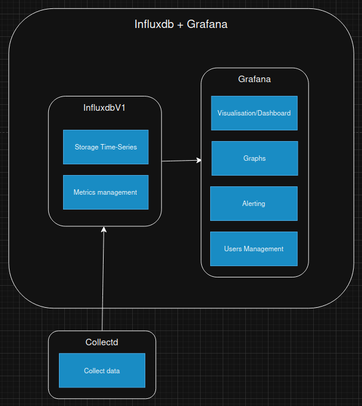

# InfluxDB

Après avoir rédigé notre série d'articles sur nos benchmarks des options de monitoring, nous avons tenté d'ansibliser notre prototype Graphite + Grafana.  
Malheureusement, Graphite est un système composé de plusieurs composants, chacun ayant ses propres dépendances Python. Nous n'avons pas trouvé de rôles Ansible récents (moins de 6 ans) et, malgré plusieurs tentatives de mises à jour manuelles, nous avons rencontré de nombreux problèmes de compatibilités Python.  

C’est en cherchant des alternatives à Graphite, compatibles avec Collectd et Grafana, que nous nous sommes penchés sur InfluxDB.  

## Présentation

**Description** : InfluxDB est une base de données temporelle (time-series database) conçue en 2013 et optimisée pour la rapidité.  
Il en existe aujourd'hui trois versions gratuites open source, chacune ayant sa version entreprise.  
- **InfluxDB V1**, écrite en **Go**, est compatible nativement avec Collectd (sans intermédiaire) et n’intègre pas d’interface web.  
- **InfluxDB V2** et **V3**, écrites en **Rust**, proposent une interface web intégrée, mais ne sont pas compatibles avec Collectd sans passer par l’agent **Telegraf**.  

Toutes les versions s’intègrent nativement avec Grafana.

**Docker** : Il existe plusieurs [images Docker officielles](https://hub.docker.com/_/influxdb/) pour chaque version d’InfluxDB.  
Nous avons choisi la plus récente de la V1 : **influxdb:1.11.8**.

## Structure

- [**InfluxDB V1**](https://docs.influxdata.com/influxdb/v1/) : Base de données temporelle qui reçoit les données, les indexe, les stocke et les met à disposition sur un port dédié.  
- [**Grafana**](https://grafana.com/) : Plateforme de visualisation graphique proposant une interface web moderne, la génération de graphiques, l’alerting et la gestion des utilisateurs. Elle se connecte directement à InfluxDB pour observer les données collectées par ce dernier.

## Configuration

### Fichiers de configuration

- [**/etc/influxdb/influxdb.conf** (InfluxDB V1)](https://github.com/iroco-co/bench-monitoring-dashboard/blob/main/docker_grafana_influxdb/influxdb/conf/influxdb.conf) : Fichier de configuration d’InfluxDB, incluant l’ajout de la configuration pour Collectd.  
- [**docker-compose.yaml**](https://github.com/iroco-co/bench-monitoring-dashboard/blob/main/docker_grafana_influxdb/docker-compose.yaml) : Fichier Docker Compose pour lancer InfluxDB et Grafana, avec un Docker Network pour la communication.

### Interface Web / Base de données (Grafana)

**Data Source** : Nous avons ajouté une source de données InfluxDB dans Grafana. Cela permet à Grafana de se connecter à InfluxDB et d’explorer les données envoyées par Collectd.

**Dashboard** : Nous avons créé un dashboard pour visualiser les données collectées par Collectd. Chaque graphique a été configuré pour utiliser ces données. Grafana permet d’explorer automatiquement les métriques disponibles dans InfluxDB, ce qui simplifie grandement la création des graphiques.

## Résultats

### Observations

InfluxDB V1 est un simple binaire sans dépendances externes, donc très simple à installer.  
Il est fortement axé sur l’efficacité et la rapidité d’exécution, ce qui est encourageant pour la suite.  
Il est nativement compatible avec Collectd et Grafana, ce qui rend sa configuration très simple.

### Performances

#### CPU

Influxdb semble être peu gourmand en CPU avec une utilisation moyenne de **11,12%**.

#### RAM

Influxdb semble être peu gourmand en RAM avec une utilisation moyenne de **3,17%**.

### Conclusion

InfluxDB V1 a plusieurs avantages.
C'est une solution qui se concentre uniquement sur nos besoins, sans fonctionnalités superflues.  
Il n'y a pas de dépendances externes puisque influxdb se résume à un binaire. 
Ses performances sont très bonnes que ce soit en utilisation CPU et RAM.
La seule limite est que seule une version antérieure (bien qu’encore maintenue) d’InfluxDB est compatible nativement avec Collectd. Nous espérons que cette version restera maintenue dans les années à venir.

---

Retrouvez les autres articles de cette série (à venir dans les prochains jours) :

- [Benchmark monitoring - Agents](/monitoring-agents/)
- [Benchmark monitoring - Introduction](/monitoring-introduction/)
- [Benchmark monitoring - Nagios](/monitoring-nagios/)
- [Benchmark monitoring - Zabbix](/monitoring-zabbix/)
- [Benchmark monitoring - Graphite + Grafana](/monitoring-graphite/)
- [Benchmark monitoring - Conclusion](/monitoring-conclusion/)
