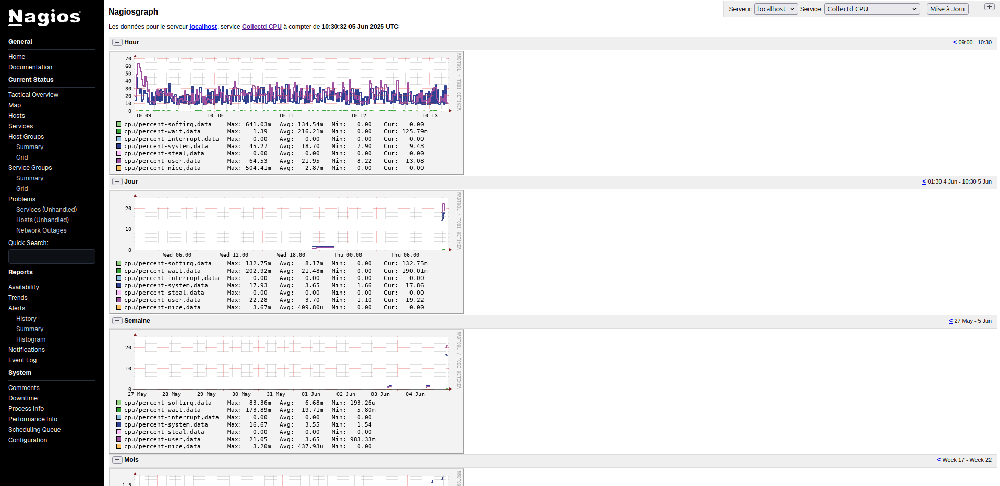
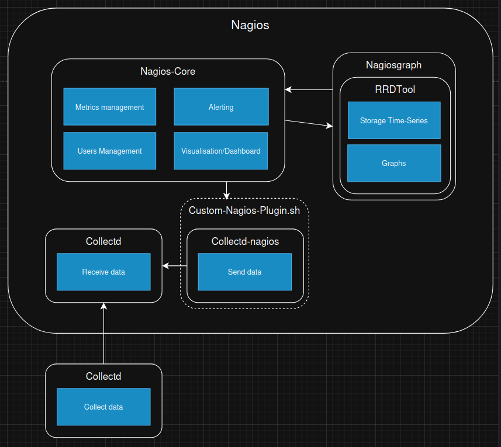
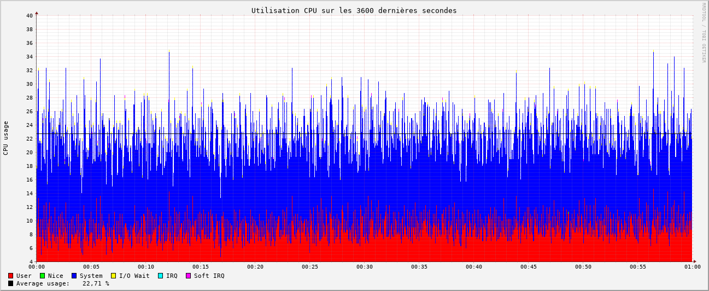

# Nagios

## Présentation

- **Description** : Né en 1999, Nagios s’appuie sur une configuration textuelle (nombreux fichiers de conf) avec un noyau central et un vaste écosystème de plugins pour surveiller les services réseau, les hôtes et équipements. Originellement open-source, il est aujourd'hui ne l'est aujourd'hui que partiellement (licence GPLv2) avec des plugins payants. Il est souvent utilisé dans les entreprises pour sa robustesse et sa fiabilité, mais son interface web est vieillissante et peu intuitive. Il est compatible avec un grand nombre de logiciels différents, mais nécessite une configuration complexe pour fonctionner comme attendu. 
- **Docker** : Il existe un docker de Nagios qui permet de déployer facilement Nagios avec Nagiosgraph. Il est disponible sur [Docker Hub](https://hub.docker.com/r/jasonrivers/nagios).
- **Alternative** :   Il existe un fork open-source de Nagios appelé [**Icinga**](https://icinga.com/) qui propose une interface web moderne de nagios, mais nous ne l'avons pas testé car il ne propose pas de création de graphiques ni de stockage de données sur sa version Docker officiel. Il est donc nécessaire de le coupler avec un outil externe comme **Nagiosgraph** ou **Graphite + Grafana** et nous allons déjà analyser ces options.

## Structure

  - **Nagios-Core** : Gère la surveillance des métriques, les utilisateurs et les notifications. Fournie l'interface web.
  - **Nagiosgraph** : Utilise **RRDTool** pour stocker les données en séries temporelles et générer des graphiques.
  - **Interface Web** : Permet de visualiser l'état des services et hôtes.
  - [**collectd-nagios**](https://www.collectd.org/documentation/manpages/collectd-nagios.html) : Un utilitaire tiers qui convertit les données de Collectd en un format que Nagios peut comprendre. Il est utilisé pour intégrer Collectd avec Nagios. 
  - **check_collectd_combined.sh**: Combine les métriques de Collectd par services (RAM, CPU, Disk File, Network) et les afficher dans un mème graphique.

## Configuration

- **Utilitaire tiers**:
  - Nous avons installé l'utilitaire [**collectd-nagios**](https://www.collectd.org/documentation/manpages/collectd-nagios.html) pour utiliser Collectd avec Nagios.
- **Création de script**:
  -  Nous avons écrit un script [**check_collectd_combined.sh**](https://github.com/iroco-co/bench-monitoring-dashboard/blob/main/nagios/Custom-Nagios-Plugins/check_collectd_combined.sh) pour récupérer des métriques multi-critères (Comme la CPU: user/system/idle). 
- **Fichiers de configuration**:
  - [**/etc/nagios/objects/templates.cfg**](https://github.com/iroco-co/bench-monitoring-dashboard/blob/main/nagios/nagios/etc/objects/templates.cfg) : Fichier de configuration des templates pour la configuration du template (fréquence de récupération des données, type) de tous les services (RAM, CPU, Disk File, Network) qui utilisent Collectd.
  - [**/etc/nagios/objects/localhost.cfg**](https://github.com/iroco-co/bench-monitoring-dashboard/blob/main/nagios/nagios/etc/objects/localhost.cfg) : Fichier de configuration de l'hôte local pour la configuration des services basés sur notre template. C'est ici que nous définissons le nom des métriques pour chaque service.
  - [**/etc/nagios/objects/commands.cfg**](https://github.com/iroco-co/bench-monitoring-dashboard/blob/main/nagios/nagios/etc/objects/commands.cfg) : Fichier de configuration des commandes pour la configuration des commandes qui seront exécutés par les services configurés. Ici, nous faisons appelle au plugin [**check_collectd_combined.sh**](https://github.com/iroco-co/bench-monitoring-dashboard/blob/main/nagios/Custom-Nagios-Plugins/check_collectd_combined.sh) pour récupérer les données de Collectd.
  - [**/etc/nagiosgraph/nagiosgraph.conf**](https://github.com/iroco-co/bench-monitoring-dashboard/blob/main/nagios/nagiosgraph/etc/nagiosgraph.conf) : Fichier de configuration des graphiques et des bdd en *time series* **RRDTool** utilisé par **NagiosGraph** pour la configuration des graphiques qui seront affichés dans l'interface web de NagiosGraph.

## Résultats

### Observations

  - Une première observation est que Nagios et Collectd ne sont pas directement compatibles. En effet, Nagios ne peut pas directement lire les données envoyées par Collectd. Cependant, il existe un utilitaire appelé [**collectd-nagios**](https://www.collectd.org/documentation/manpages/collectd-nagios.html) qui le permet. Cela nécessite une configuration supplémentaire, mais cela permet d'utiliser Collectd pour surveiller les hôtes et les services dans Nagios. La configuration de Nagios et doit être modifié à chaque ajout de variable observée dans Collectd ce qui rend l'évolution du système fastidieuse.

### Performances

  - **CPU** : 
    - 
    - Nagios semble être peu gourmand en CPU. On observe une utilisation moyenne de **24%** de celui-ci. De plus, son utilisation est stable dans le temps, ce qui est un bon point pour la fiabilité de l'outil.
  - **RAM** :
    - 
    - Nagios semble être peu gourmand en RAM. On en observe une utilisation moyenne de **3,52%**. De plus, son utilisation est stable dans le temps, malgré une très légère augmentation sur la durée.

### Conclusion

Nagios est un outil de monitoring robuste et fiable. Il offre de bonnes performances en termes de consommation CPU et RAM. 
Cependant, il nécessite une configuration complexe pour fonctionner correctement, notamment pour intégrer Collectd. Son interface web est vieillissante et peu intuitive et ne permet pas simplement de créer un Dashboard. Il n'est que partiellement open-source ce qui est un mauvais point selon nos critères.

