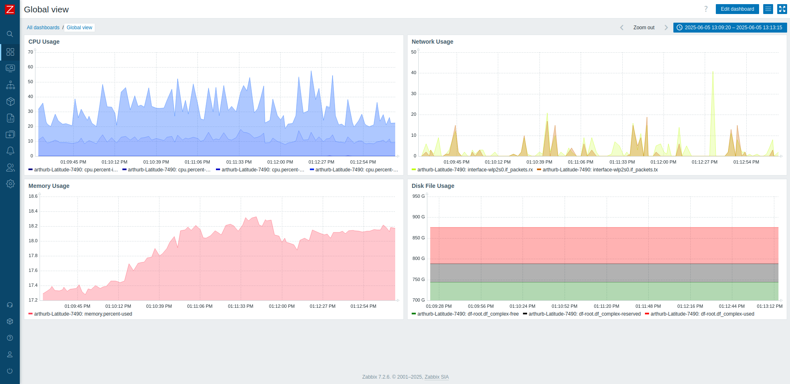
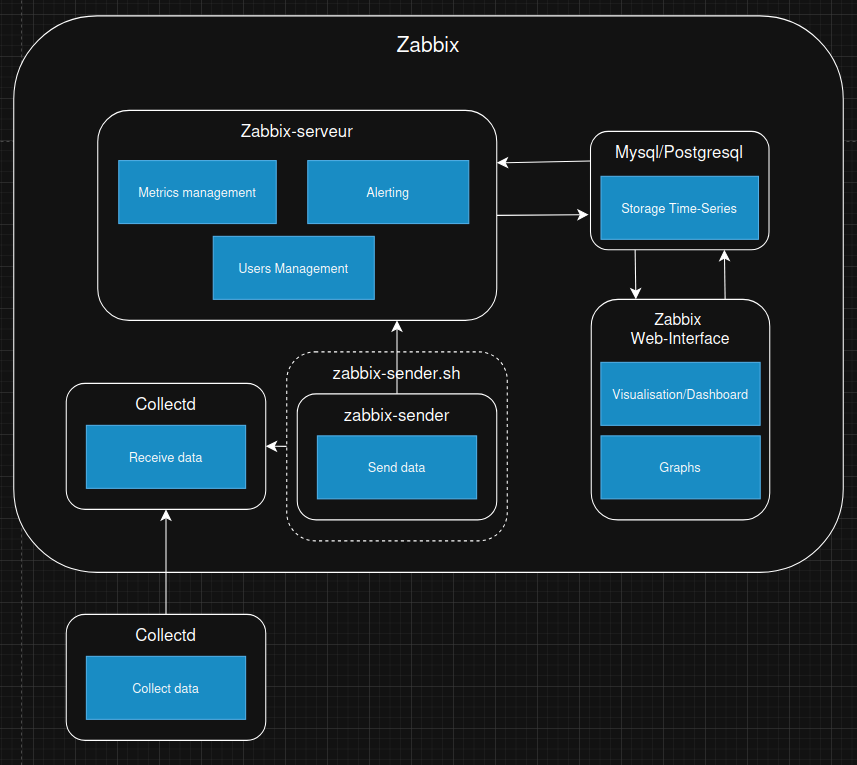
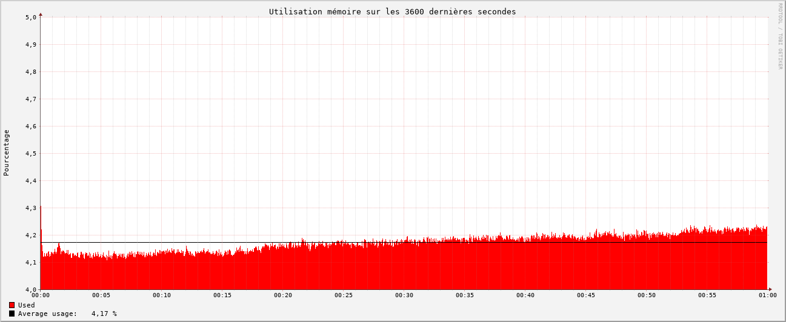

# Zabbix

## Présentation

  - **Description** : Zabbix est un outil open source d’entreprise doté d’une architecture distribuée (agents, proxies) et d’une base de données (MySQL/PostgreSQL/Oracle) pour stocker les métriques. Il fournit une interface moderne et un grand nombre de fonctionnalités relatives au monitoring.
  - **Docker** : Il existe un docker compose officiel de Zabbix qui permet de déployer facilement Zabbix avec une base de données MySQL ou PostgreSQL. Il est disponible sur [Github](https://github.com/zabbix/zabbix-docker).

## Structure

  - [**Zabbix-server**](https://www.zabbix.com/documentation/7.2/en/manual/appendix/config/zabbix_server) : Noyau central qui gère la gestion des métriques, les utilisateurs et le système d'alerte.
  - **Mysql/PostgreSQL** : Base de données utilisée pour stocker les métriques et la configuration de Zabbix.
  - [**Zabbix-Web-Interface**](https://hub.docker.com/r/zabbix/zabbix-web-service) : Interface web pour visualiser l'état des services et hôtes, ainsi que de configurer Zabbix. C'est également lui qui génère les graphiques.
  - [**zabbix-sender**](https://www.zabbix.com/documentation/current/en/manpages/zabbix_sender) : Un utilitaire tiers qui permet d'envoyer des données à Zabbix en utilisant le protocole Zabbix trapper. Il est utilisé pour intégrer Collectd avec Zabbix. Nécessite le script **zabbix-sender.sh** pour récupérer les métriques de Collectd et les envoyer à formater pour **zabbix-sender**.

## Configuration

- **Interface Web / BDD** (*Zabbix peut également être configuré via des fichiers de config*):
  - [**Data Collection/Hosts**](http://localhost/zabbix.php?action=host.list) : Nous avons créé un hôte pour notre serveur de test.
  - **Data Collection/Hosts/items** : Nous avons créé des items pour chaque métrique que nous voulions surveiller (CPU, RAM, Réseau). Puis, nous avons configuré chaque item pour qu'il utilise le type de données **Zabbix trapper** et le type de données **Collectd** ce qui permet à Zabbix de collecter les données envoyées par Collectd.
  - [**Dashboard**](http://localhost/zabbix.php?action=dashboard.view): Nous avons créé un graph par groupe de métriques (CPU, RAM, Réseau, Disk File) pour visualiser les données collectées par Collectd. Nous avons ensuite dû configurer chaque graphique pour qu'il utilise les items que nous avons créés précédemment.
- **Utilitaire tiers**:
  - Nous avons installé l'utilitaire [**zabbix-sender**](https://www.zabbix.com/documentation/current/en/manpages/zabbix_sender) pour envoyer les données depuis Collectd vers Zabbix. Cet utilitaire permet d'envoyer des données à Zabbix en utilisant le protocole Zabbix trapper.
- **Création de script**:
  - Il nous a également été nécessaire de créer un script [**zabbix-sender.sh**](https://github.com/iroco-co/bench-monitoring-dashboard/blob/main/src/zabbix-sender.sh) pour convertir les données de Collectd en un format que [**zabbix-sender**](https://www.zabbix.com/documentation/current/en/manpages/zabbix_sender) peut comprendre. Ce script est exécuté par collectd à chaque fois que les datas sont mesurés.

## Résultats

### Observations

  Une première observation est qu'il n'existe pas de solution simple pour intégrer Collectd et zabbix. Cependant, il existe un utilitaire, [**zabbix-sender**](https://www.zabbix.com/documentation/current/en/manpages/zabbix_sender), qui le permet avec un peu de configuration. La configuration de zabbix doit être modifiée à chaque ajout de variable observée dans Collectd ce qui peut être lourd en cas d'évolution du système.
Zabbix peut être configuré, soit via l'interface web, soit par fichier de conf ce qui le rend assez flexible aux modifications.

### Performances

  - **CPU** :
    - 
    - Zabbix semble être très gourmand en CPU. On en observe de très fortes variations, avec des pics à plus de 200%. La moyenne d'utilisation CPU est de **160%**.
  - **RAM** :
    - 
    - Zabbix semble être peu gourmand en RAM. On en observe une utilisation moyenne de **4,67%** . Cependant, il reste une légère augmentation de l'utilisation de la RAM au fil du temps, ce qui pourrait causer des problèmes de performance à long terme. Nous soupçonnons que cela vient de la gestion des données dans la base de données.

### Conclusion

Zabbix est un outil de monitoring complet et moderne, mais il est gourmand en CPU. Il nécessite une configuration supplémentaire pour intégrer Collectd, ce qui peut être une difficulté supplémentaire en ce qui concerne la maintenabilité. Mis à part cela, Zabbix reste assez simple à configurer. Il offre une interface web moderne et une grande flexibilité dans la configuration des graphiques et des alertes. Il est compatible avec les bases de données MySQL et PostgreSQL, ce qui laisse le choix de la technologie de stockage. Il faudra cependant veiller à la gestion de la mémoire à long terme pour éviter les problèmes de performance. Zabbix est entièrement open-source, ce qui est un bon point selon nos critères.

Retrouvez les autres articles de cette série (à venir dans les prochains jours) :

- [Benchmark monitoring - Agents](/monitoring-agents/)
- [Benchmark monitoring - Introduction](/monitoring-introduction/)
- [Benchmark monitoring - Nagios](/monitoring-nagios/)
- [Benchmark monitoring - Graphite + Grafana](/monitoring-graphite/)
- [Benchmark monitoring - InfluxDB + Grafana](/monitoring-influxdb)
- [Benchmark monitoring - Conclusion](/monitoring-conclusion/)
