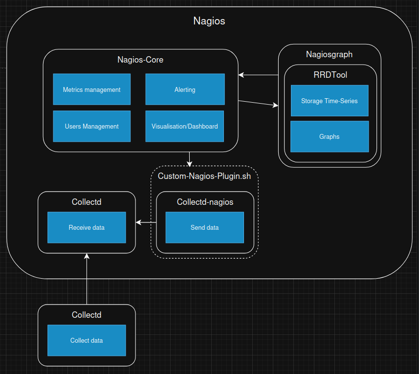

# Nagios

## Présentation

(Nous n'avons pas trouvé d'option open-source pour un dashboard moderne de Nagios. Nous sommes donc resté sur l'interface disponible depuis le docker officiel de Nagios)
  - **Description** : Né en 1999, Nagios s’appuie sur une configuration textuelle (nombreux fichiers de conf) avec un noyau central et un vaste écosystème de plugins pour surveiller les services réseau, les hôtes et équipements. Originellement open-source, il est aujourd'hui partiellement open-source (licence GPLv2) avec des plugins payants. Il est souvent utilisé dans les entreprises pour sa robustesse et sa fiabilité, mais son interface web est vieillissante et peu intuitive. Il est compatible avec un grand nombre de logiciels différents, mais nécessite une configuration complexe pour fonctionner correctement. 

  - **Docker** : Il existe un docker de Nagios qui permet de déployer facilement Nagios avec Nagiosgraph. Il est disponible sur [Docker Hub](https://hub.docker.com/r/jasonrivers/nagios).

  - **Alternative** :   Il existe un fork open-source de Nagios appelé [**Icinga**](https://icinga.com/) qui propose une interface web moderne de nagios, mais nous n'avons pas eu l'occasion de le tester car il ne propose pas ses propres graphiques ni son stockage de données. Il est donc nécessaire de le coupler avec un outil de stockage de données et de génération de graphiques comme **Nagiosgraph** ou **Graphite + Grafana** ce qui complexifie la configuration.

## Structure

  - **Nagios-Core** : Gère la surveillance des métriques, les utilisateurs et les notifications. Fournie l'interface web.
  - **Nagiosgraph** : Utilise **RRDTool** pour stocker les données en séries temporelles et générer des graphiques.
  - **Interface Web** : Pour visualiser l'état des services et hôtes.
  - [**collectd-nagios**](https://www.collectd.org/documentation/manpages/collectd-nagios.html) : Un utilitaire tiers qui permet de convertir les données de Collectd en un format que Nagios peut comprendre. Il est utilisé pour intégrer Collectd avec Nagios. Nécessite le plugin **check_collectd_combined.sh** pour récupérer les métriques de Collectd et les combiner par services (RAM, CPU, Disk File, Network).

## Configuration
- **Utilitaire tiers**:
  - Nous avons du installer l'utilitaire [**collectd-nagios**](https://www.collectd.org/documentation/manpages/collectd-nagios.html) qui permet de convertir les données de Collectd en un format que Nagios peut comprendre.
- **Création de script**:
  -  Nous avons du créer un plugin [**check_collectd_combined.sh**](https://github.com/iroco-co/bench-monitoring-dashboard/blob/main/nagios/Custom-Nagios-Plugins/check_collectd_combined.sh) qui permet de récupérer les données de Collectd. Il fait appel à l'utilitaire [**collectd-nagios**](https://www.collectd.org/documentation/manpages/collectd-nagios.html) pour convertir les données de Collectd en un format que Nagios peut comprendre. Puis le plugin combine les données appartenant à un même service pour les afficher dans le même graphique.
- **Fichiers de configuration**:
  - [**/etc/nagios/objects/templates.cfg**](https://github.com/iroco-co/bench-monitoring-dashboard/blob/main/nagios/nagios/etc/objects/templates.cfg) : Fichier de configuration des templates. M'a permis de configurer le template de tous les services utilisés par collectd (fréquence, type).
  - [**/etc/nagios/objects/localhost.cfg**](https://github.com/iroco-co/bench-monitoring-dashboard/blob/main/nagios/nagios/etc/objects/localhost.cfg) : Fichier de configuration de l'hôte local. M'a permis de configurer les services Network, FileSystème CPU et RAM basé sur mon template.
  - [**/etc/nagios/objects/commands.cfg**](https://github.com/iroco-co/bench-monitoring-dashboard/blob/main/nagios/nagios/etc/objects/commands.cfg) : Fichier de configuration des commandes. M'a permis de configurer les commandes qui seront exécutés par les services Network, FileSystème CPU et RAM. Ici, nous avons du faire appel au plugin [**check_collectd_combined.sh**](https://github.com/iroco-co/bench-monitoring-dashboard/blob/main/nagios/Custom-Nagios-Plugins/check_collectd_combined.sh) pour récupérer les données de Collectd.
  - [**/etc/nagiosgraph/nagiosgraph.conf**](https://github.com/iroco-co/bench-monitoring-dashboard/blob/main/nagios/nagiosgraph/etc/nagiosgraph.conf) : Fichier de configuration des graphiques et des bdd en time series RRDTool utilisé par NagiosGraph. M'a permis de configurer les graphiques qui seront affichés dans l'interface web de NagiosGraph.
## Résultats

### Observations
  - Une première observation est que Nagios et Collectd ne sont pas directement compatibles. En effet, Nagios ne peut pas directement lire les données envoyées par Collectd. Cependant, il existe un utilitaire appelé [**collectd-nagios**](https://www.collectd.org/documentation/manpages/collectd-nagios.html) qui permet de convertir les données de Collectd en un format que Nagios peut comprendre. Cela nécessite une configuration supplémentaire, mais cela permet d'utiliser Collectd pour surveiller les hôtes et les services dans Nagios. La configuration de Nagios et doit être modifié à chaque ajout de variable observée dans Collectd.

### Performances
  - **CPU** : 
    - [Graphique CPU de Nagios](../../images/monitoring-dasboard-benchmark/nagios_cpu_usage.png)
    - Nagios semble être peu gourmand en CPU. On observe une utilisation moyenne de **24%** du CPU. De plus, son utilisation est stable dans le temps, ce qui est un bon point pour la fiabilité de l'outil.
  - **RAM** :
    - [Graphique RAM de Nagios](../../images/monitoring-dasboard-benchmark/nagios_memory_usage.png)
    - Nagios semble être peu gourmand en RAM. On observe une utilisation moyenne de **3,52%** de la RAM. De plus, son utilisation est stable dans le temps, malgré une très légère augmentation au cours du temps.

### Conclusion
Nagios est un outil de monitoring robuste et fiable, mais il est complexe à configurer. Il nécessite une configuration complexe pour fonctionner correctement, notamment pour intégrer Collectd. Cependant, il offre de bonnes performances en termes de consommation CPU et RAM. Son interface web est vieillissante et peu intuitive et ne permet pas simplement de créer un Dashboard. Il est partiellement open-source ce qui est un mauvais point selon nos critères.

