Problème du jour, nous souhaitons renommer une colonne dans une table de notre schéma SQL. 
Problème simple ou compliqué ?
Explorons les enjeux et impacts potentiels de cette action à priori anodine par l’angle de l’architecture évolutive et du déploiement continu.

Voici ce que nous voulons faire : renommer `certificate.ts` -> `certificate.updated_time` pour clarifier la signification de cette colonne.


## C'est facile, non ?

Cela peut sembler simple, en particulier avec des outils modernes tels que knex.js[^1].

[^1]: [Knex.js][knex-js] permet de simplifier l'utilisation de SQL dans l'écosystème javascript

[knex-js]:https://knexjs.org/

De façon intuitive, utilisons les capacités fournies par notre outil.

Ici, je peux utiliser la fonction de migration de knex pour renommer la colonne.

```js
/**
 * @param { import('knex').Knex } knex
 * @returns {Promise<Knex.SchemaBuilder>}
 */
export const up = async (knex) => {
        return knex.schema.alterTable("certificate", certificate =>
            certificate.renameColumn("ts", "updated_time"))
    }

/**
 * @param { import('knex').Knex } knex
 * @returns {Promise<Knex.SchemaBuilder>}
 */
export const down = async (knex) => {
    return knex.schema.alterTable("certificate", certificate =>
        certificate.renameColumn("updated_time", "ts"))
}
```

Simple, rapide ! Pour faire autrement ?

## Refactoring Databases

Mais du coup, qu'est-ce qui pourrait nous arriver d'affreux maintenant ?

Le livre Refactoring Databases[^2] nous propose des pratiques, patrons et des recommendations pour décider quand et comment mettre en place des [refactorings][tag-refactoring] de [base de données][tag-base-de-donnees].

[^2]: Le livre [Refactoring Databases — Evolutionary Database Design][refactoring-databases-book], son [site compagnon][refactoring-databases-companion-site] et un [webinaire d'introduction][recipes-for-continuous-database-integration-webinar] pour donner un aperçu des sujets du livre.

[refactoring-databases-book]:https://martinfowler.com/books/refactoringDatabases.html

[refactoring-databases-companion-site]:https://databaserefactoring.com/

[recipes-for-continuous-database-integration-webinar]:https://www.thoughtworks.com/insights/books/recipes-for-continuous-database-integration

[tag-refactoring]:/tags/#Refactoring-ref

[tag-base-de-donnees]:/tags/#Base%20de%20données-ref

Ces pratiques peuvent permettre de cheminer vers la mise en place d'["Evolutionary Architecture"][evolutionary-architecture] permettant le ["Continuous Delivery"][continuous-delivery].
À notre échelle, nous ne voyons pas forcément d'intérêt à mettre en place l'ensemble de ces pratiques.

Nous trouvons cependant utile de les connaitre et de comprendre les contextes où elles peuvent être utiles.

[continuous-delivery]:https://continuousdelivery.com/

[evolutionary-architecture]:https://continuousdelivery.com/implementing/architecture/

## Est-ce que ça vaut le coup pour Iroco ?

Si d'autres applications s'appuient sur la même base de données, le changement de nom de colonne peut entrainer des dysfonctionnements.

Aussi, même si notre base de données n'était utilisée que par une seule application,  
notre migration de base de données n'est pas forcément exécutée en même temps que notre application.

Nous pouvons choisir de prendre des précautions particulières si nous pensons être dans une de ces situations particulières.

À titre d'expérimentation, nous décidons de mettre en place l'approche "Evolutionary Database".

## Déroulé du refactoring

Nom de la colonne à renommer : `ts`
Nouveau nom : `updated_time`

L'objectif ici est de créer la nouvelle colonne `updated_time` et de la faire cohabiter avec l'ancienne `ts`.
Dans une phase de transition les données sont synchronisées entre les 2 colonnes.

1. Introduire une nouvelle colonne `updated_time`
2. (optionnel) introduire un trigger de synchronisation pour copier les données de l'ancienne colonne vers la nouvelle (et permettre aux applications de continue de fonctionner)
3. (optionnel) renommer les autres colonnes (si le nom de la colonne est utilisé dans d'autres tables)


### Couplage avec PostgreSQL

En introduisant des [triggers PostgreSQL][postgres-trigger] dans nos migrations de base de données, nous nous couplons à cette technologie. Cela n'est pas anodin. Cela signifie que nous ne pouvons désormais dérouler les scripts de migration que sur une base de données PostgreSQL.

Knex permet de s'abstraire du vendeur de base de données à l'aide du concept de dialectes. Les dialectes traduisent les requêtes écrites via l'API de knex en SQL spécifique à chaque vendeur (ex. Mysql, PostgreSQL ...). Cela apporte de la flexibilité et simplifie la maintenance et les migrations de schéma.

En introduisant du code SQL PostgreSQL "natif" dans nos scripts de migration, nous réduisons cette flexibilité. À moins que nous écrivions des versions spécifiques de nos migrations s'appuyant sur du code SQL natif pour chaque vendeur de base de données que nous souhaitons supporter.

[postgres-trigger]: https://www.postgresql.org/docs/current/triggers.html

### Avant


### Pendant la période de transition


### Terminer la transition


## Le refactoring en action

### Migration de transition

#### Script de migration "aller"

```sql
-- add new column
ALTER TABLE certificate
    ADD updated_time TIMESTAMP WITH TIME ZONE NULL;

-- in this specific case we drop default value (which was set to 
-- CURRENT_TIMESTAMP). During the transition, we will temporarily 
-- handle it in a trigger.
ALTER TABLE certificate
    ALTER COLUMN ts DROP DEFAULT;

-- trace changes on old column
COMMENT ON COLUMN certificate.updated_time
    IS 'Renaming of ts column, finaldate = April 12 2024';
COMMENT ON COLUMN certificate.ts
    IS 'Renamed to updated_time, dropdate = April 12 2024';

-- copy current data from the old column to the new column
UPDATE certificate
SET updated_time = certificate.ts;

-- Setup triggers to synchronize 'ts' and 'updated_time' both ways
-- It allows applications to work both with old (`ts`) and new 
-- (`updated_time`) columns
CREATE OR REPLACE FUNCTION temporarily_sync_certificate_ts_inserting()
    RETURNS TRIGGER
    LANGUAGE PLPGSQL AS
$$
BEGIN

    -- temporarily set defaults in this trigger 
    -- (because triggers and columns with default do not like each other
    -- that much)
    IF (NEW.updated_time IS NULL AND NEW.ts IS NULL) THEN
        NEW.ts := CURRENT_TIMESTAMP;
    END IF;

    IF NEW.updated_time IS NULL THEN
        NEW.updated_time := NEW.ts;
    END IF;

    IF NEW.ts IS NULL THEN
        NEW.ts := NEW.updated_time;
    END IF;

    RETURN NEW;
END;
$$;

CREATE OR REPLACE FUNCTION temporarily_sync_certificate_ts_updating()
    RETURNS TRIGGER
    LANGUAGE PLPGSQL AS
$$
BEGIN

    IF NEW.updated_time <> OLD.updated_time THEN
        NEW.ts = NEW.updated_time;
    END IF;

    IF NEW.ts <> OLD.ts THEN
        NEW.updated_time := NEW.ts;
    END IF;

    RETURN NEW;
END;
$$;

CREATE OR REPLACE TRIGGER TemporarilySynchronizeCertificateTsUpdate
    BEFORE UPDATE
    ON certificate
    FOR EACH ROW
EXECUTE FUNCTION temporarily_sync_certificate_ts_updating();

CREATE OR REPLACE TRIGGER TemporarilySynchronizeCertificateTsInsert
    BEFORE INSERT
    ON certificate
    FOR EACH ROW
EXECUTE FUNCTION temporarily_sync_certificate_ts_inserting();


```

#### Script de migration "retour arrière"

```sql
      ALTER TABLE certificate
    ALTER COLUMN ts SET NOT NULL;

ALTER TABLE certificate
    ALTER COLUMN ts SET DEFAULT CURRENT_TIMESTAMP;

DROP TRIGGER TemporarilySynchronizeCertificateTsInsert ON certificate;
DROP TRIGGER TemporarilySynchronizeCertificateTsUpdate ON certificate;
DROP FUNCTION temporarily_sync_certificate_ts_updating();
DROP FUNCTION temporarily_sync_certificate_ts_inserting();

ALTER TABLE certificate
    DROP COLUMN updated_time;
```

### Tester pendant la période de transition

Il est important de pouvoir tester notre migration afin de revenir en arrière si besoin.

Il ne faut pas oublier de tester la migration dans les 2 sens et avec des données.

Notre logiciel dispose de beaucoup de tests unitaires et de quelques tests d'intégration qui s'appuient sur une base de données de test.
Nous pouvons ainsi tester notre migration dans un environnement isolé et suffisamment réaliste.

Si nous avions joué la migration complète sans phase de transition, nous aurions des tests qui auraient échoué.


Or, quand nous arrêtons la migration sur la phase de transition, les tests passent.


La base de donnée supportant le passé (colonne `ts` ) et le futur (colonne `updated_time`). Nous pouvons refactor notre code de production en maintenant les tests d'intégration passants.

Cela nous permet de continuer à développer en [TDD][test-driven-development] et de maintenir une [intégration continue][continuous-integration] de notre code.

[test-driven-development]: https://wiki.c2.com/?TestDrivenDevelopment

[continuous-integration]: https://wiki.c2.com/?ContinuousIntegration

### Refactoring côté application

Comme nous avons un filet de test efficace, nous pouvons faire le refactoring du code de l'application.

Note : nous pourrions déployer la migration SQL intermédiaire indépendamment de celle du code.

`domain.ts`

```diff
--- a/src/domain.ts
+++ b/src/domain.ts
@@ -60,7 +60,7 @@
 	vdomain_id?: number
 	domain_name: string
 	chain: string
-	ts: Date
+	updated_time: Date
 }
 
 export type Certificate = CertificateSafe & {

```

En appliquant le refactoring sur l'objet domain dans le code typescript, je m'assure d'avoir coché "search for text occurences".


Quand je lance l'aperçu, je me rends compte que le refactoring propose beaucoup trop de choses qui sont incorrectes. Il faudra qu'on les exclue du refactoring.


Pas de soucis ! Je lance le refactoring qui a lieu en 2 temps.

Au final voici les refactorings que je garderai


Au format diff, ça donne :

```diff
Index: src/lib/server/repository.ts
IDEA additional info:
Subsystem: com.intellij.openapi.diff.impl.patch.CharsetEP
<+>UTF-8
===================================================================
diff --git a/src/lib/server/repository.ts b/src/lib/server/repository.ts
--- a/src/lib/server/repository.ts	(revision 03f8013483e2a17f117cbcfb0e49cec8b794f379)
+++ b/src/lib/server/repository.ts	(date 1712912688481)
@@ -64,7 +64,7 @@
 				'dkim_public_key',
 				'available',
 				'certificate.domain_name',
-				'certificate.ts',
+				'certificate.updated_time',
 				'certificate.chain'
 			)
 			.from<VirtualDomainSafe>('virtual_domain')
Index: src/domain.ts
IDEA additional info:
Subsystem: com.intellij.openapi.diff.impl.patch.CharsetEP
<+>UTF-8
===================================================================
diff --git a/src/domain.ts b/src/domain.ts
--- a/src/domain.ts	(revision 03f8013483e2a17f117cbcfb0e49cec8b794f379)
+++ b/src/domain.ts	(date 1712912688479)
@@ -60,7 +60,7 @@
 	vdomain_id?: number
 	domain_name: string
 	chain: string
-	ts: Date
+	updated_time: Date
 }
 
 export type Certificate = CertificateSafe & {
Index: src/lib/server/acmeClient.ts
IDEA additional info:
Subsystem: com.intellij.openapi.diff.impl.patch.CharsetEP
<+>UTF-8
===================================================================
diff --git a/src/lib/server/acmeClient.ts b/src/lib/server/acmeClient.ts
--- a/src/lib/server/acmeClient.ts	(revision 03f8013483e2a17f117cbcfb0e49cec8b794f379)
+++ b/src/lib/server/acmeClient.ts	(date 1712912688479)
@@ -46,6 +46,6 @@
 		domain_name: commonName,
 		skey: key.toString(),
 		chain: cert.toString(),
-		ts: DateTime.now().toJSDate()
+		updated_time: DateTime.now().toJSDate()
 	}
 }
Index: test/integration/admin/certs.spec.ts
IDEA additional info:
Subsystem: com.intellij.openapi.diff.impl.patch.CharsetEP
<+>UTF-8
===================================================================
diff --git a/test/integration/admin/certs.spec.ts b/test/integration/admin/certs.spec.ts
--- a/test/integration/admin/certs.spec.ts	(revision 03f8013483e2a17f117cbcfb0e49cec8b794f379)
+++ b/test/integration/admin/certs.spec.ts	(date 1712912688483)
@@ -105,7 +105,7 @@
 				domain_name: `${subdomainPrefix}.bar.com`,
 				chain: `${subdomainPrefix} cert`,
 				skey: `${subdomainPrefix} skey`,
-				ts: DateTime.now().toJSDate()
+				updated_time: DateTime.now().toJSDate()
 			})
 		}
 	})
@@ -198,7 +198,7 @@
 			domain_name: 'imap.foo.com',
 			skey: 'imap secret key',
 			chain: 'imap certificate',
-			ts: DateTime.now().toJSDate()
+			updated_time: DateTime.now().toJSDate()
 		})
 		expect(returnValue).toBeDefined()
 
@@ -206,14 +206,14 @@
 		expect(domain.certificates).toHaveLength(1)
 		expect(domain.certificates[0].domain_name)
 		    .toEqual('imap.foo.com')
 		expect(domain.certificates[0].chain)
 		    .toEqual('imap certificate')
-		expect(domain.certificates[0].ts).toBeDefined()
+		expect(domain.certificates[0].updated_time).toBeDefined()
 
 		await repository.saveCert({
 			vdomain_id: domain.id,
 			domain_name: 'smtp.foo.com',
 			skey: 'smtp secret key',
 			chain: 'smtp certificate',
-			ts: DateTime.now().toJSDate()
+			updated_time: DateTime.now().toJSDate()
 		})
 		domain = await repository.getDomainWithCertificates('foo.com')
 		expect(domain.certificates).toHaveLength(2)

```

### Autres impacts inattendus

En cherchant dans Github si la colonne `ts` n'était pas utilisée ailleurs, je me suis rendu compte que c'était le cas dans un script bash.

```sh
SQL_REQUEST="INSERT INTO certificate 
    ( domain_name, vdomain_id, skey, chain, ts )
SELECT  
    '$SUBDOMAIN', virtual_domain.id, '$SKEY', '$CHAIN', '$ISO_CERT_DATE'
FROM  virtual_domain
WHERE virtual_domain.name = '$DOMAIN'
ON CONFLICT (domain_name)
DO UPDATE SET
   skey = '$SKEY',
   chain= '$CHAIN',
   ts   = '$ISO_CERT_DATE' # 👈 ici l'ancien nom de colonn est utilisé
;"

psql  -h localhost -U iroco ******* -c "$SQL_REQUEST"

```

Pas de soucis, je suis encore en période de transition. Mes triggers continuent de synchroniser les deux colonnes.

Finalement, pour terminer notre refactoring, nous devons mettre à jour le script avant d'appliquer la migration de finalisation.


Modification du script bash :

```diff
--- .../import_certificate.sh
+++ .../import_certificate.sh

   chain= '$CHAIN',
-   ts   = '$ISO_CERT_DATE'
+   updated_time   = '$ISO_CERT_DATE'

;"

psql  -h localhost -U iroco ******* -c "$SQL_REQUEST"

```

### Fin de la période de transition

Maintenant que nous nous sommes assurés à l'aide de nos tests que les différentes applications qui utilisent cette colonne ont été mises à jour, nous pouvons terminer le refactoring.

#### Script de migration "aller"

```sql

-- Handle default value again  
alter table public.certificate
    alter column updated_time set default CURRENT_TIMESTAMP;

-- Now that we have a default value, we can set back the column as 
-- not null  
alter table public.certificate
    alter column updated_time set not null;

-- cleanup temporary functions and triggers  
DROP TRIGGER SynchronizeCertificateTsInsert ON certificate;
DROP TRIGGER SynchronizeCertificateTsUpdate ON certificate;
DROP FUNCTION temporarily_sync_certificate_ts_updating();
DROP FUNCTION temporarily_sync_certificate_ts_inserting();

--finally drop the old column  
ALTER TABLE certificate
    DROP COLUMN ts;

```

#### Script de migration "retour arrière"

```sql

ALTER TABLE certificate
    ALTER COLUMN updated_time DROP DEFAULT;

ALTER TABLE certificate
    ALTER COLUMN updated_time DROP NOT NULL;

ALTER TABLE certificate
    ADD ts TIMESTAMP WITH TIME ZONE NULL;

-- trace changes on old column
COMMENT ON COLUMN certificate.updated_time
    IS 'Renaming of ts column, finaldate = April 12 2024';
COMMENT ON COLUMN certificate.ts
    IS 'Renamed to updated_time, dropdate = April 12 2024';

-- copy current data from the new column to the old column
UPDATE certificate
SET ts = certificate.updated_time;

ALTER TABLE certificate
    ALTER COLUMN ts SET NOT NULL;

-- Setup triggers to synchronize 'ts' and 'updated_time' both ways
-- It allows applications to work both with old (`ts`) 
-- and new (`updated_time`) columns
CREATE OR REPLACE FUNCTION temporarily_sync_certificate_ts_inserting()
    RETURNS TRIGGER
    LANGUAGE PLPGSQL AS
$$
BEGIN

    -- temporarily set defaults in this trigger
    -- (because triggers and columns with default do not like 
    -- each other that much)
    IF (NEW.updated_time IS NULL AND NEW.ts IS NULL) THEN
        NEW.ts := CURRENT_TIMESTAMP;
    END IF;

    IF NEW.updated_time IS NULL THEN
        NEW.updated_time := NEW.ts;
    END IF;

    IF NEW.ts IS NULL THEN
        NEW.ts := NEW.updated_time;
    END IF;

    RETURN NEW;
END;
$$;

CREATE OR REPLACE FUNCTION temporarily_sync_certificate_ts_updating()
    RETURNS TRIGGER
    LANGUAGE PLPGSQL AS
$$
BEGIN

    IF NEW.updated_time <> OLD.updated_time THEN
        NEW.ts = NEW.updated_time;
    END IF;

    IF NEW.ts <> OLD.ts THEN
        NEW.updated_time := NEW.ts;
    END IF;

    RETURN NEW;
END;
$$;

CREATE OR REPLACE TRIGGER TemporarilySynchronizeCertificateTsUpdate
    BEFORE UPDATE
    ON certificate
    FOR EACH ROW
EXECUTE FUNCTION temporarily_sync_certificate_ts_updating();

CREATE OR REPLACE TRIGGER TemporarilySynchronizeCertificateTsInsert
    BEFORE INSERT
    ON certificate
    FOR EACH ROW
EXECUTE FUNCTION temporarily_sync_certificate_ts_inserting();

```

### Tester les migrations

Afin de nous assurer que nos scripts de migration fonctionnent

À partir d'une base de données sans aucune tables.

Nous jouons l'ensemble des scripts de migration pour voir si on atteint la structure de base de données souhaitée.

```sh
# Jouer la migration en entier 
npx knex migrate:latest
npx knex seed:run
```

```
Requiring external module /home/dev/src/iroco-app/node_modules/interpret/mjs-stub
Working directory changed to ~/src/iroco-app/src/db
Using environment: test
Batch 1 run: 10 migrations
```

```
Requiring external module /home/dev/src/iroco-app/node_modules/interpret/mjs-stub
Working directory changed to ~/src/iroco-app/src/db
Using environment: test
Ran 2 seed files
```

Le résultat correspond bien à ce qu'on attend.


Mais attend une minute.
La migration a bien fonctionné, mais la table `certificates` est vide !
Il faudrait qu'on puisse tester la phase de transition avec des données !

Nous allons écrire quelques requêtes SQL pour vérifier que le comportement attendu est toujours le même.

```sql
-- test de la valeur par défaut

INSERT INTO certificate
    (domain_name, vdomain_id, skey, chain)
VALUES ('foo1', 1, 'baz', 'buzz');

SELECT *
FROM certificate
WHERE domain_name = 'foo1';
```

| domain\_name | vdomain\_id | skey | chain | updated\_time                     |
|:-------------|:------------|:-----|:------|:----------------------------------|
| foo1         | 1           | baz  | buzz  | 2024-04-12 19:39:51.184668 +00:00 |

Testons le retour arrière

```sh
# Jouer la dernière migration en retour arrière
npx knex --knexfile src/db/knexfile.mjs migrate:down
```

```
Requiring external module /home/dev/src/iroco-app/node_modules/interpret/mjs-stub
Working directory changed to ~/src/iroco-app/src/db
Using environment: test
Batch 1 rolled back the following migrations:
20240412144635_rename_ts_to_update_time_in_certificate_finalize.mjs
```


Testons la synchronisation des 2 colonnes.

```sql
-- test du trigger de synchronisation en insertion  
-- test de la valeur par défaut  
INSERT INTO certificate
    (domain_name, vdomain_id, skey, chain)
VALUES ('foo2', 1, 'baz', 'buzz');

SELECT *
FROM certificate
WHERE domain_name = 'foo2';

```

La valeur par défaut est bien insérée et propagée dans les 2 colonnes.

| domain\_name | vdomain\_id | skey | chain | updated\_time                     | ts                                |
|:-------------|:------------|:-----|:------|:----------------------------------|:----------------------------------|
| foo2         | 1           | baz  | buzz  | 2024-04-12 19:47:29.681816 +00:00 | 2024-04-12 19:47:29.681816 +00:00 |

```sql
-- insertion dans la colonne ts  
INSERT INTO certificate
    (domain_name, vdomain_id, skey, chain, ts)
VALUES ('foo3', 1, 'baz', 'buzz',
        '2020-01-01 19:47:29.681816 +00:00');

SELECT *
FROM certificate
WHERE domain_name = 'foo3';

```

La valeur est bien insérée et propagée dans la colonne `updated_time`

| domain\_name | vdomain\_id | skey | chain | updated\_time                     | ts                                |
|:-------------|:------------|:-----|:------|:----------------------------------|:----------------------------------|
| foo3         | 1           | baz  | buzz  | 2020-01-01 19:47:29.681816 +00:00 | 2020-01-01 19:47:29.681816 +00:00 |

```sql
-- insertion dans la colonne updated_time  
INSERT INTO certificate
    (domain_name, vdomain_id, skey, chain, updated_time)
VALUES ('foo4', 1, 'baz', 'buzz',
        '2022-02-02 19:47:29.681816 +00:00');

SELECT *
FROM certificate
WHERE domain_name = 'foo4';
```

La valeur est bien insérée et propagée dans la colonne `ts`

| domain\_name | vdomain\_id | skey | chain | updated\_time                     | ts                                |
|:-------------|:------------|:-----|:------|:----------------------------------|:----------------------------------|
| foo4         | 1           | baz  | buzz  | 2022-02-02 19:47:29.681816 +00:00 | 2022-02-02 19:47:29.681816 +00:00 |

```sql
-- test du trigger de synchronisation en mise à jour  
UPDATE certificate
SET updated_time = '2026-06-06 19:47:29.681816 +00:00'
WHERE domain_name = 'foo4';

SELECT *
FROM certificate
WHERE domain_name = 'foo4';
```

La valeur est bien mise à jour et propagée dans la colonne `ts`

| domain\_name | vdomain\_id | skey | chain | updated\_time                     | ts                                |
|:-------------|:------------|:-----|:------|:----------------------------------|:----------------------------------|
| foo4         | 1           | baz  | buzz  | 2026-06-06 19:47:29.681816 +00:00 | 2026-06-06 19:47:29.681816 +00:00 |

```sql
UPDATE certificate
SET ts = '2023-03-03 19:47:29.681816 +00:00'
WHERE domain_name = 'foo4';

SELECT *
FROM certificate
WHERE domain_name = 'foo4';
```

La valeur est bien mise à jour et propagée dans la colonne `updated_time`

| domain\_name | vdomain\_id | skey | chain | updated\_time                     | ts                                |
|:-------------|:------------|:-----|:------|:----------------------------------|:----------------------------------|
| foo4         | 1           | baz  | buzz  | 2023-03-03 19:47:29.681816 +00:00 | 2023-03-03 19:47:29.681816 +00:00 |

Nous savons ainsi que pendant la période de transition, les applications peuvent utiliser indistinctement la colonne `ts` ou la colonne `updated_time`

Jouons la migration de finalisation en avant, pour voir si les données sont bien conservées.

D'abord regardons le contenu de la table :

```sql
SELECT *
FROM certificate;
```

| domain\_name | vdomain\_id | skey | chain | updated\_time                     | ts                                |
|:-------------|:------------|:-----|:------|:----------------------------------|:----------------------------------|
| foo1         | 1           | baz  | buzz  | 2024-04-12 19:39:51.184668 +00:00 | 2024-04-12 19:39:51.184668 +00:00 |
| foo2         | 1           | baz  | buzz  | 2024-04-12 19:47:29.681816 +00:00 | 2024-04-12 19:47:29.681816 +00:00 |
| foo3         | 1           | baz  | buzz  | 2020-01-01 19:47:29.681816 +00:00 | 2020-01-01 19:47:29.681816 +00:00 |
| foo4         | 1           | baz  | buzz  | 2023-03-03 19:47:29.681816 +00:00 | 2023-03-03 19:47:29.681816 +00:00 |

Jouons la migration de finalisation.

```sh
npx knex migrate:up
```

Tout se passe bien

```
Requiring external module /home/dev/src/iroco-app/node_modules/interpret/mjs-stub
Working directory changed to ~/src/iroco-app/src/db
Using environment: test
Batch 2 ran the following migrations:
20240412144635_rename_ts_to_update_time_in_certificate_finalize.mjs
```

C'est bien le schéma attendu.


Est-ce que les données sont toujours là ?

```sql
SELECT *
FROM certificate;
```

Oui !

| domain\_name | vdomain\_id | skey | chain | updated\_time                     |
|:-------------|:------------|:-----|:------|:----------------------------------|
| foo1         | 1           | baz  | buzz  | 2024-04-12 19:39:51.184668 +00:00 |
| foo2         | 1           | baz  | buzz  | 2024-04-12 19:47:29.681816 +00:00 |
| foo3         | 1           | baz  | buzz  | 2020-01-01 19:47:29.681816 +00:00 |
| foo4         | 1           | baz  | buzz  | 2023-03-03 19:47:29.681816 +00:00 |

Rejouons la migration à l'envers (en transition)

```sh
npx knex migrate:down
```


Est-ce que les données sont toujours là ?

```sql
SELECT *
FROM certificate;
```

Oui !

| domain\_name | vdomain\_id | skey | chain | updated\_time                     | ts                                |
|:-------------|:------------|:-----|:------|:----------------------------------|:----------------------------------|
| foo1         | 1           | baz  | buzz  | 2024-04-12 19:39:51.184668 +00:00 | 2024-04-12 19:39:51.184668 +00:00 |
| foo2         | 1           | baz  | buzz  | 2024-04-12 19:47:29.681816 +00:00 | 2024-04-12 19:47:29.681816 +00:00 |
| foo3         | 1           | baz  | buzz  | 2020-01-01 19:47:29.681816 +00:00 | 2020-01-01 19:47:29.681816 +00:00 |
| foo4         | 1           | baz  | buzz  | 2023-03-03 19:47:29.681816 +00:00 | 2023-03-03 19:47:29.681816 +00:00 |

Rejouons la migration précédente à l'envers (état initial)

```sh
npx knex migrate:down
```


Est-ce que les données sont toujours là ?

```sql
SELECT *
FROM certificate;
```

Oui !

| domain\_name | vdomain\_id | skey | chain | ts                                |
|:-------------|:------------|:-----|:------|:----------------------------------|
| foo1         | 1           | baz  | buzz  | 2024-04-12 19:39:51.184668 +00:00 |
| foo2         | 1           | baz  | buzz  | 2024-04-12 19:47:29.681816 +00:00 |
| foo3         | 1           | baz  | buzz  | 2020-01-01 19:47:29.681816 +00:00 |
| foo4         | 1           | baz  | buzz  | 2023-03-03 19:47:29.681816 +00:00 |

Et enfin jouons la migration en avant (en transition)

```sh
npx knex migrate:down
```


Est-ce que les données sont toujours là ?

```sql
SELECT *
FROM certificate;
```

Oui !

| domain\_name | vdomain\_id | skey | chain | ts                                | updated\_time                     |
|:-------------|:------------|:-----|:------|:----------------------------------|:----------------------------------|
| foo1         | 1           | baz  | buzz  | 2024-04-12 19:39:51.184668 +00:00 | 2024-04-12 19:39:51.184668 +00:00 |
| foo2         | 1           | baz  | buzz  | 2024-04-12 19:47:29.681816 +00:00 | 2024-04-12 19:47:29.681816 +00:00 |
| foo3         | 1           | baz  | buzz  | 2020-01-01 19:47:29.681816 +00:00 | 2020-01-01 19:47:29.681816 +00:00 |
| foo4         | 1           | baz  | buzz  | 2023-03-03 19:47:29.681816 +00:00 | 2023-03-03 19:47:29.681816 +00:00 |

### Appliquer les changements en production

Nous avons testé dans un environnement de staging

- Que la migration fonctionne dans les 2 sens
- Que les applications peuvent fonctionner avec l'ancienne et la nouvelle colonne en période de transition
- Que les données sont bien conservées et mises à jour de façon synchronisée

Nous pouvons maintenant dérouler le refactoring en production.

```mermaid
---
title: Refactoring -> base de données en phase de transition, application, script bash
---
%%{init: {  'theme': 'dark', 'gitGraph': { 'mainBranchName': 'iroco-app'}} }%%
gitGraph LR:
    commit id: " "
    commit id: "  "
    branch iroco-app-ansible
    branch db
    commit id: "migration intermédiaire"
    checkout iroco-app
    commit id: "refactoring du code"
    checkout iroco-app-ansible
    commit id: "refactoring du script bash"
    checkout iroco-app
    merge iroco-app-ansible
```



Nous pouvons laisser la base en phase de transition quelque temps.

Puis, nous pourrons finaliser la migration pour nettoyer let triggers et supprimer définitivement la colonne `ts`.

## Conclusion

```mermaid
---
title: Déroulé complet du refactoring
---
%%{init: {  'theme': 'dark', 'gitGraph': { 'mainBranchName': 'iroco-app'}} }%%
gitGraph LR:
    commit id: " "
    commit id: "  "
    branch iroco-app-ansible
    branch db
    commit id: "migration intermédiaire"
    checkout iroco-app
    commit id: "refactoring du code"
    checkout iroco-app-ansible
    commit id: "refactoring du script bash"
    checkout iroco-app
    merge iroco-app-ansible
    checkout db
    commit id: "migration de finalisation"
    checkout iroco-app
    merge db
    commit id: "   "
```



Comme nous l'avons dit au début de cet article, Iroco n'a pas forcément besoin d'aller à ce niveau pour mettre en place un tel refactoring.

Comme nous travaillons en binômage[^3] et que nous partageons une propriété collective de notre code[^4], nous savons assez bien les impacts d'un tel refactoring.

[^3]: Binômage, aussi connu sous le nom de ["Pair programming"][pair-programming] consiste à développer à 2 sur le même ordinateur et sur le même code.

[pair-programming]: http://www.extremeprogramming.org/rules/pair.html

[^4]: La propriété collective du code, aussi connue sous le nom ["Collective Ownership"][collective-ownership] est un principe visant à s'assurer que suffisamment de membres de l'équipe ont une connaissance du code. En faisant du code la propriété de l'équipe et pas des contributeurs individuels, on favorise une discipline de [programmation avec moins d'égo][programmation-sans-ego] (voir aussi [The Ten Commandments of Egoless Programming][programmation-sans-ego-10-commandments]
). On souhaite ainsi réduire le [Facteur d'autobus][bus-factor] et d'éviter que des personnes deviennent bloquantes pour l'avancée de l'équipe.

[collective-ownership]: http://www.extremeprogramming.org/rules/collective.html

[programmation-sans-ego]: https://fr.wikipedia.org/wiki/Programmation_sans_ego
[programmation-sans-ego-10-commandments]: https://blog.codinghorror.com/the-ten-commandments-of-egoless-programming/

[bus-factor]: https://fr.wikipedia.org/wiki/Facteur_d%27autobus

Cela dit, nous pensons qu'il est important de savoir faire ce type d'évolution incrémentales car :

- En pratiquant lorsque ce n'est pas critique, nous serons prêt si ça le devient
- Nous savons mieux estimer les impacts de l'approche simple (`rename()` de knex[^1]) et de l'approche "Evolutionary Database"[^2]

Au final, nous allons certainement utiliser le rename de knex. 

La fonctionnalité concernée par ce refactoring n'est utilisée que par nous-même. Nous préférons éviter d'ajouter de la complexité dans nos migrations. 
Cela pour garder notre conception [la plus simple possible][simplicity-in-xp].

[simplicity-in-xp]: http://www.extremeprogramming.org/rules/simple.html

---

