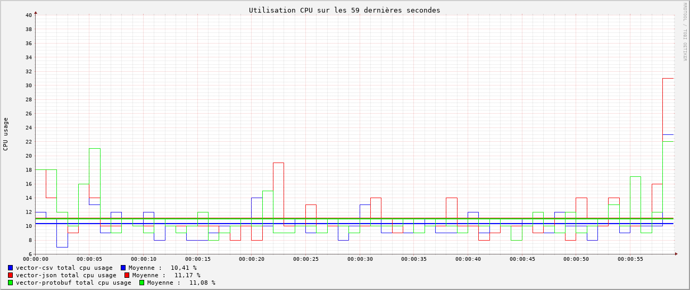
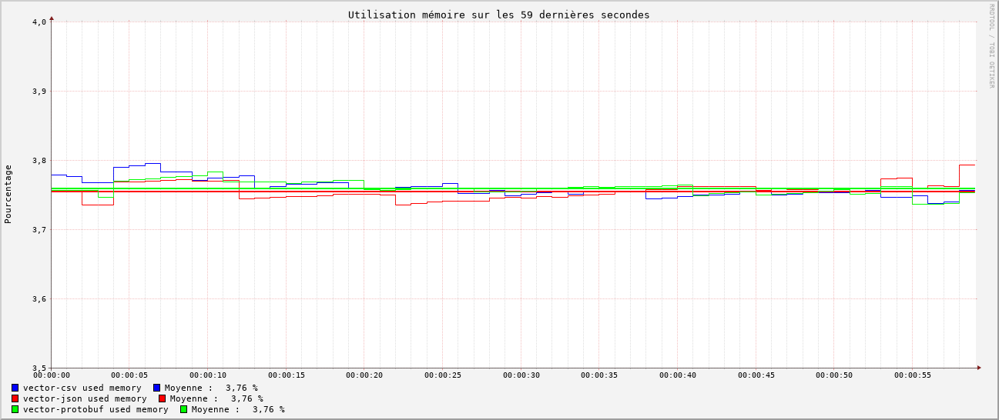
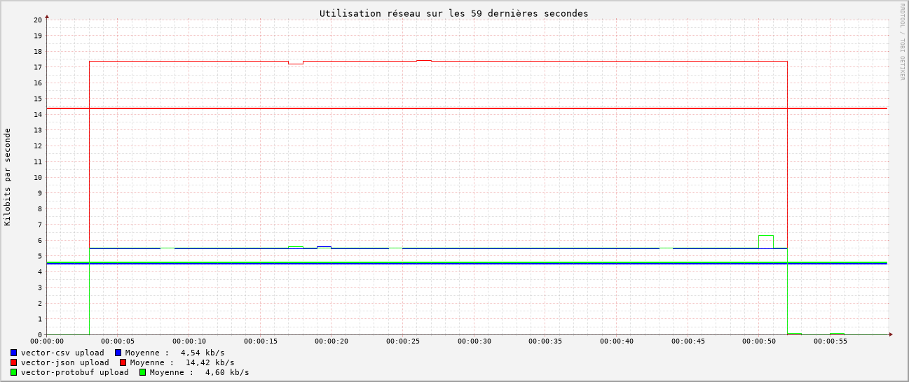
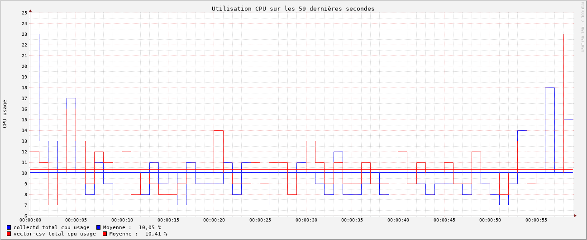
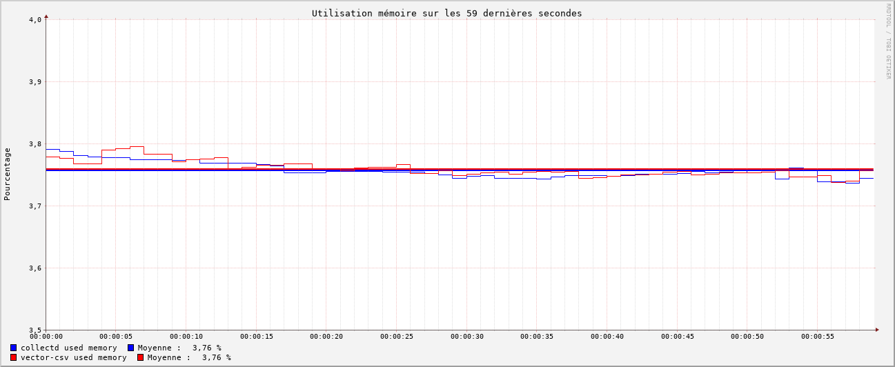
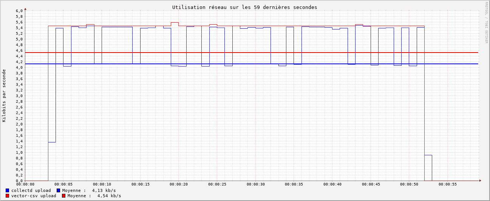

# Introduction

Le monitoring assure l'observabilité des systèmes informatiques. Il permet de recueillir, d'analyser et de visualiser les données relatives à l'état des serveurs, des applications et des réseaux. Il se présente généralement sous la forme d'agents installés sur chaque machine, qui collectent des métriques et les envoient à un serveur central, chargé de leur traitement (voir la suite de nos articles sur le monitoring). Cet article s'inscrit dans une série de benchmarks visant à évaluer différents outils de monitoring, en commençant par les agents de monitoring.

## Contexte et enjeux

Afin de faire évoluer le produit Iroco dans une optique de numérique durable et responsable, nous devons choisir un outil de monitoring qui sera la base de décisions structurelles à long terme. Ce choix n'est pas anodin, puisqu'il impactera directement l'avenir de l'architecture de la plateforme. Nous allons donc tester plusieurs outils de monitoring pour identifier celui qui répondra le mieux à nos besoins. Pour cela, nous allons réaliser un benchmark de différents agents de monitoring.

### Push v.s. Pull

Un système de monitoring peut aller chercher ses données régulièrement (*polling*) de manière centralisée sur chaque machine ou être en attente des données envoyées par chaque serveur. Dans le premier cas, on parle de système de monitoring en mode *pull* et dans le deuxième cas de mode *push*.
Il est aussi possible de faire les deux en mème temps.
Pour plus de détails: [Pull or Push: How to Select Monitoring Systems ?](https://www.alibabacloud.com/blog/pull-or-push-how-to-select-monitoring-systems_599007)

Les tests de cette série d'articles sont plus orientés **push** pour plusieurs raisons:

- Nous préférons l'aspect *bottom-up* de la démarche push en adaptant pour chaque type de machine les évènements qui seront envoyés (serveur mail, serveur web, serveur de bdd, ... ).
- Il existe une multitude de moyens et d'interlocuteurs différents pour envoyer les évènements les plus pertinents à l'instant où ils se produisent (reverse proxy, serveur backend, système d'exploitation, ... ).
- Dans les cas où le *pull* est le plus approprié, rien ne l’empêche d'exposer des sondes (SNMP, JMX, ... ), et d'aller lire dessus de manière centralisée.

C'est une orientation relative à notre contexte de petite structure avec une stack sans orchestrateur docker (Kubernetes). La question de push ou pull est complexe et cela reste au final une question de compromis. Et qui sait ? si vous envisagez un système pull, vous trouverez peut-être dans cette série d'article des informations qui vous intéresseront.

Si vous avez des remarques, questions ou recommandations, nous sommes preneurs de vos retours.

## Les outils étudiés dans cet article : agents de monitoring

Nous nous sommes concentrés sur deux solutions d'agents monitoring :

- [**Collectd**](https://www.collectd.org/) : Réputé pour sa légèreté et sa simplicité d'utilisation (*boring tech*).  
- [**Vector**](https://vector.dev/) : Un outil plus récent et complet, offrant potentiellement plus de fonctionnalités.

## Objectifs du benchmark

Notre benchmark vise principalement à identifier l'outil le moins consommateur en ressources, dans le respect des enjeux écologiques. Pour cela, nous avons défini trois métriques clés, correspondant à l'impact environnemental mesuré sur :

- **CPU** : Pourcentage d'utilisation totale  
- **RAM** : Pourcentage d'utilisation totale  
- **Réseau** : Volume de données en upload (en KB)  

L'objectif est de tester chaque outil sur ces trois métriques afin de déterminer lequel offre le meilleur compromis entre performance et consommation.

Nous commençons par l'agent car c'est ce service qui sera répliqué sur chaque machine et qui aura donc le plus d'impact sur la consommation globale.

## Démarche méthodologique

Afin de tester l'utilisation de l'outil de monitoring, nous devons simuler une situation d'utilisation réelle.

Nous avons utilisé deux machines différentes:

- Une qui fait tourner l'agent chargé de collecter et envoyer des données.
- Une qui fait tourner l'agrégateur qui reçoit les données.

Nous plaçons les sondes logicielles suivantes:
  - CPU: avec les statistiques système dans `/proc/stat`
  - Mémoire: avec la commande `free`
  - Réseau: avec la commande `sar`

Pour plus de détails voir le script [suivant](https://github.com/iroco-co/monitoring-benchmark/blob/main/src/collect_data.sh).

### Mise en place du test

Pour l’exécution de l'agent, nous avons utilisé un laptop *Dell Latitude 7490* avec *32 Go de RAM* sous *Ubuntu 24.04.2 LTS*.

Nous avons choisi **rrdtool** pour l'historisation des données de bench collectées car il permet une collecte simple et très optimisée des données, minimisant ainsi son impact sur les résultats. De plus, il intègre un outil de génération de graphiques nativement.

Nous n'induisons pas de charge avec un injecteur, mais nous observons l'impact du collecteur de métriques sur la machine en isolation (avec les services de base de l'OS).

### Conditions du test

Pour assurer l'équité des tests, les deux outils doivent réaliser des tâches aussi similaires que possible, en envoyant les mêmes informations à la même fréquence. Nous avons donc choisi d'envoyer les métriques suivantes :

- Utilisation CPU  
- Utilisation mémoire  
- Utilisation réseau  

Pour obtenir des résultats interprétables et identifier d'éventuelles fuites mémoire, nous avons décidé de tester les outils dans des conditions plus exigeantes que leur future utilisation en production. Ainsi, nous avons configuré l'envoi des métriques **une fois par seconde** lors des différents tests, là où nous visons **une fois toutes les 5 min** en production.

De plus, nous avons enregistré les données **5 secondes avant et 5 secondes après** chaque test afin d'observer l'impact du démarrage de l'outil sur les performances de la machine.

### Déroulement du benchmark

Pour assurer la reproductibilité des observations, nous avons mis en place le système de scripte suivant :

- **Configuration des agents** : Deux scripts distincts configurent respectivement [Collectd](https://github.com/iroco-co/monitoring-benchmark/blob/main/src/collectd_config.sh) et [Vector](https://github.com/iroco-co/monitoring-benchmark/blob/main/src/vector_config.sh) en tant qu'agents.  
- **Lancement des agrégateurs** : Deux scripts distincts exécutent et lancent [Collectd](https://github.com/iroco-co/monitoring-benchmark/blob/main/src/collectd_aggregator.sh) et [Vector](https://github.com/iroco-co/monitoring-benchmark/blob/main/src/vector_aggregator.sh) en tant qu'agrégateurs (ces scripts doivent être lancés sur une autre machine).  
- **Collecte des données** : Un [script dédié](https://github.com/iroco-co/monitoring-benchmark/blob/main/src/collect_data.sh) assure la collecte des métriques avec [*rrdtool*](https://oss.oetiker.ch/rrdtool/).  
- **Génération des graphiques** :  
  - Un [premier script](https://github.com/iroco-co/monitoring-benchmark/blob/main/src/generate_graph.sh) génère des graphiques pour chaque métrique de chaque outil.  
  - Un [second script](https://github.com/iroco-co/monitoring-benchmark/blob/main/src/agregate_graph.sh) superpose les courbes des deux outils pour une même métrique sur un seul graphique.  
- **Déroulé du benchmark** : Un [script principal](https://github.com/iroco-co/monitoring-benchmark/blob/main/src/benchmark.sh) orchestre l'ensemble du processus, en enchaînant les étapes de configuration, de collecte et de génération des graphiques.  

---

# Vector

## Présentation

Vector est un framework de monitoring performant écrit en Rust. Il offre une très grande configurabilité. Il est compatible avec la plupart des nouvelles technologies (ex : Prometheus, Elasticsearch, GrafanaCloud).

Il permet à la fois de collecter, filtrer, envoyer et agréger les données, ce qui en fait un outil très complet.

Nous avions l'intuition que cette forte configurabilité et ce grand nombre de fonctionnalités auront nécessairement un impact sur les performances.

## Configuration

Afin d'être au plus proche du fonctionnement de Collectd, nous avons [configuré Vector](https://github.com/iroco-co/monitoring-benchmark/blob/main/src/vector_config.sh) pour une communication en UDP.

Nous devions également choisir un type d'encodage des données. Vector en propose, nous avons décidé de tester les performances de trois encodages standards : **CSV**, **Protobuf** et **JSON**.

## Résultats

### CPU

Nous avons constaté une très faible différence entre les différents encodages, avec un léger avantage pour le format **CSV**, suivi de **Protobuf** et enfin **JSON**.

### Mémoire

Nous n'avons pas observé de différence significative entre les formats.

### Réseau

Le format **CSV** est celui qui consomme le moins de bande passante, suivi de près par **Protobuf**. Le format **JSON**, en revanche, est **trois fois plus** intensif.

### Note

Lors de nos différentes recherches de fonctionnement et de compréhension de l'outil, il semble que vector soit plus adapté à des environments de type cloud/Kubernetes. Cela apparaît notamment sur la liste des [*sinks*](https://vector.dev/docs/reference/configuration/sinks/) (destinations/transports) de Vector.

---

# Collectd

## Présentation

Collectd est un outil de monitoring très léger et simple d'utilisation. Il est largement utilisé dans le monde de l'open source et bénéficie d'une documentation complète. [Il est écrit en C](https://github.com/collectd/collectd).

## Configuration

Contrairement à Vector, Collectd utilise son propre système d'encodage de données, optimisé pour la performance. Les seules configurations nécessaires ont été de choisir les types de données à envoyer ainsi que l'intervalle d'envoi des données (1 par seconde).

## Résultats

### CPU

Nous avons observé une faible différence entre Collectd et Vector en format CSV, avec un léger avantage pour **Collectd**.

### Mémoire

Nous n'avons pas observé de différence significative entre les deux outils.

### Réseau

Le mode d'envoi de Collectd et de Vector sont différents :
Collectd envoi les indicateurs de manière groupée. On peut le voir par les créneaux bleus. Tandis que vector envoi les données continuellement.

Les moyennes montrent un léger avantage pour Collectd mais qui reste négligeable vue la quantité de donnée (~4 ko/s).

## Note

Collectd est un système très versatile. La communauté a [créé plus de 100 plugins](https://github.com/collectd/collectd/wiki/Table-of-Plugins) qui lui permettent de récupérer des métriques pour grand nombre de services et de protocoles.

---

# Conclusion

Ce tableau récapitulatif synthétise les principaux avantages et inconvénients de Collectd et Vector d'après notre expérience :

| Critères                              | Collectd                                   | Vector                                        |
|---------------------------------------|--------------------------------------------|-----------------------------------------------|
| **Communauté**                        | Large                                      | Moyenne                                       |
| **Documentation**                     | Complète                                   | Complète                                      |
| **Versatilité**                       | Élevée pour la récolte de métriques         | Élevée pour traitement des flux de métriques                                        |
| **Simplicité d'installation**         | Élevée (installé via `apt`)                  | Bonne (installation par script `curl`)          |
| **Configuration**                     | Petits projets → Simple   Gros projets → Complexe | Petits projets → Moyenne   Gros projets → Bonne |
| **Courbe d'apprentissage**            | Faible                                     | Moyenne                                       |
| **Rôles Ansible existants**           | Oui                                        | Oui                                           |
| **Compatibilité avec d'autres outils**| Élevée                                    | Élevée (orienté cloud)                                        |

## Versatilité (fonctionnalités, paramétrabilité)

- **Collectd** reste un outil très simple et robuste. Il comporte cependant un grand nombre de plugins qui permettent de l'adapter à de nombreux cas d'utilisation. Toutefois, l'utilisation de ces plugins peut rendre la configuration et la maintenabilité plus complexes étant donné que chaque type de serveur aura une collecte différente ;
- **Vector** offre une très grande configurabilité. Il a été possible de configurer le protocole de communication, le format des données, les filtres, etc. De plus, il possède son propre langage, le VRL (Vector Remap Language), qui permet de parser, filtrer et transformer les données de manière très fine.

## Simplicité d'installation

- **Collectd** est très simple à installer car il est directement géré par le gestionnaire de paquets (`apt`). Cependant, il est nécessaire d'installer les plugins pour des cas d'utilisation spécifiques.
- **Vector** s'installe via une requête `curl` pour télécharger le script d'installation.

## Simplicité de configuration

- **Collectd** est simple à configurer. Cependant, chaque plugin a sa propre configuration ce qui augmente la combinatoire des type de serveur/plugins.
- **Vector** offre une très grande flexibilité nativement. Il permet de configurer le protocole de communication, le format des données, les filtres, etc.

## Courbe d'apprentissage

- **Collectd** est plus simple à prendre en main. Moins de recherches ont été nécessaires pour comprendre son fonctionnement et la configuration par défaut des protocoles de communication convenait à nos besoins.
- Pour **Vector**, la création d'une configuration correspondant à nos besoins nous a demandé plus d'efforts.

## Compatibilité avec d'autres outils

- **Collectd** s'appuie sur une compatibilité éprouvée avec les outils traditionnels de surveillance (Nagios, [Ganglia](https://github.com/ganglia/), etc.).
- **Vector** offre une intégration plus fluide et moderne avec de nombreux outils d'observabilité contemporains (Elasticsearch, Kafka, AWS S3, Splunk, etc.).

## Notre choix

Compte tenu de notre infrastructure qui n'est pas (encore?) basée sur Kubernetes, et étant donné la similarité des performances des deux outils, nous optons pour l'utilisation de Collectd.

Retrouvez les autres articles de cette série (à venir dans les prochains jours) :

- [Benchmark monitoring - Introduction](/monitoring-introduction/)
- [Benchmark monitoring - Nagios](/monitoring-nagios/)
- [Benchmark monitoring - Zabbix](/monitoring-zabbix/)
- [Benchmark monitoring - Graphite + Grafana](/monitoring-graphite/)
- [Benchmark monitoring - InfluxDB + Grafana](/monitoring-influxdb)
- [Benchmark monitoring - Conclusion](/monitoring-conclusion/)
