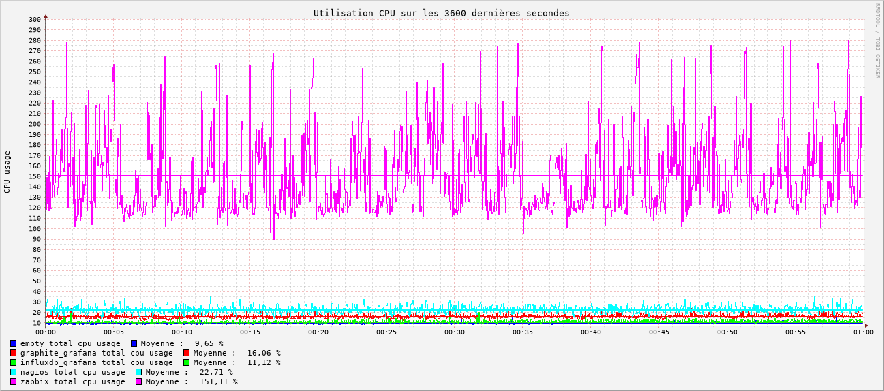
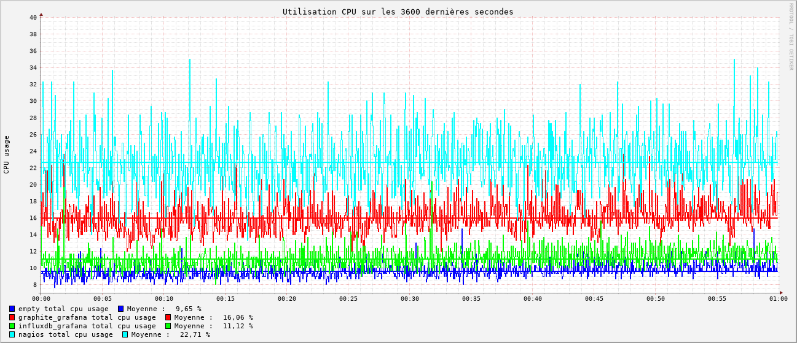
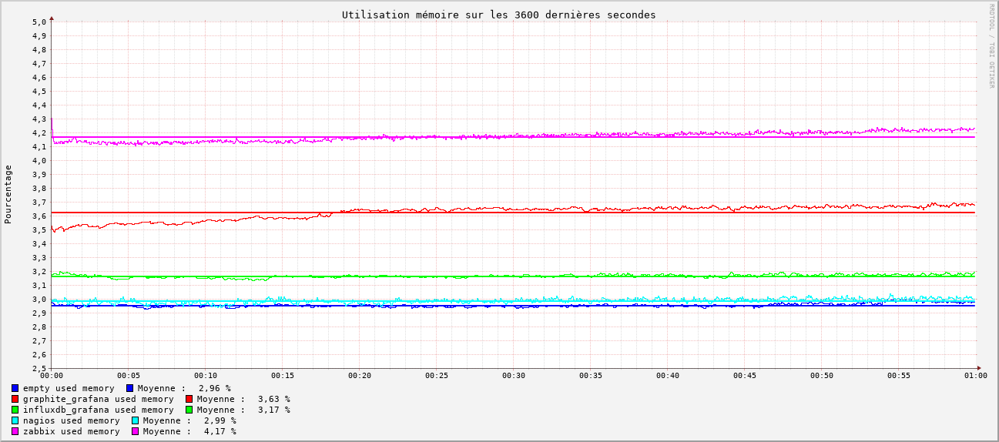

# Conclusion

Chaque graphique ci-dessous représente les mesures prises toutes les secondes et la moyenne des mesures sur une période d'une heure pour chaque outil de monitoring. Elles peuvent être comparées à une mesure témoin prise sans aucun outil de monitoring en fonctionnement (*empty*).

## CPU

Nous avons fait un deuxième graph pour éviter l'écrasement des données.

On observe que **Zabbix** est l'outil le plus gourmand en CPU, et de loin avec une moyenne de **153,62%** d'utilisation.

**Nagios**, **Graphite + Grafana** et **Influxdb + Grafana** avec des moyennes respectives de **23%**, **16%** et **11%** font mieux et sont relativement proches.

Sachant que la mesure témoin est de **9,5%** d'utilisation sans outils en fonctionnement, cela nous donne en approximation les pourcentages suivants:
  - **Zabbix** : **142%** d'utilisation CPU
  - **Nagios** : **13%** d'utilisation CPU
  - **Graphite + Grafana** : **6,5%** d'utilisation CPU
  - **Influxdb + Grafana** : **1,5%** d'utilisation CPU

## RAM

Concernant la RAM, **Zabbix** est encore l'outil le plus intensif en mémoire avec une moyenne de **4,17%** d'utilisation RAM. La différence est moins marquée que pour le CPU avec **Nagios** à **2,99%**, **Graphite + Grafana** à **3,63%** et **Influxdb + Grafana** à **3,17**.

La mesure témoin donne **2,96%** ce qui nous donne en approximation :
  - **Zabbix** : **1,21%** d'utilisation RAM
  - **Nagios** : **0,03%** d'utilisation RAM
  - **Graphite + Grafana** : **0,67%** d'utilisation RAM
  - **Influxdb + Grafana** : **0,21%** d'utilisation RAM

## Tableau récapitulatif des observations

|                         | **Nagios**                                                | **Zabbix**                                | **Graphite + Grafana**                                                                | **Influxdb V1 + Grafana**
---                          | ---                                                       | ---                                       | ---                                                                                   | ---
**Compatibilité avec Collectd**  | Compliqué avec Collectd-Nagios                            | Compliqué avec Zabbix-Sender              | Natif                                                                                 | Natif pour la V1
**Type de configuration**        | Complexe, Fichiers de conf                                | Moyen-Simple, Base de donnée              | Simple, Base de donnée + fichiers de conf                                             | Simple, Base de donnée + fichiers de conf
**Technologie de Stockage**      | rrd                                                       | choix: mysql/postgresql                   | whisper                                                                               | Influxdb
**Technologie de visualisation** | Nagiosgraph -> rrdgraph                                   | Zabbix                                    | Grafana                                                                               | Grafana
**Interface**                    | Ancienne, peu intuitive                                   | Moderne, moyennement intuitive            | Moderne, intuitive                                                                    | Moderne, intuitive
**Performances**                 | Très bonnes                                               | Moyennes                                  | Bonnes                                                                                | Très Bonnes
**Système d'alerte**             | Oui, non testé                                            | Oui, testé                                | Oui, testé                                                                            | Oui, testé
**OpenSource**                   | Partiellement, plugins payants (Icnga -> Fork OpenSource) | Oui                                       | Oui                                                                                   | Oui
**Facilité de déploiement** *     | Nombreuses dépendances, pas de rôle ansible récent        | Quelques dépendances, rôle ansible à jour | Beaucoup de dépendances, rôle ansible non à jour pour graphite et à jour pour grafana | Simple, rôle ansible à jour pour grafana, non nécessaire pour influxdb V1

*_Facilité de déploiement: automatisable avec ansible, reproductible, nombre de dépendances_

## Tableau récapitulatif des points forts et faibles selon nos critères

|Outil | points forts | points faibles |
|---|---|---|
| **Nagios** | 🟢 Très Bonnes performances   🟢 Outil Approuvé | 🔴 Configuration complexe   🔴 Interface vieillissante   🔴 N'est pas compatible avec collectd nativement   🔴 Documentation éparpillée   🔴 N'est pas totalement OpenSource |
| **Zabbix** | 🟢 Interface moderne   🟢  Documentation complète   🟢  Configuration | 🔴 Performances moyennes   🔴 N'est pas compatible avec collectd nativement   🔴 La configuration et les données sont stockées dans la mème bdd |
| **Graphite + Grafana** | 🟢 Interface moderne   🟢  Simple à configurer et à prendre en main   🟢  Compatible avec collectd nativement (Permet l'exploration automatique des métriques disponibles)   🟢  Modularité (Découplage stockage des données et génération de graphs) | 🔴 Performances moins bonne que nagios   🔴  Nécessite deux outils pour fonctionner   🔴 Nombreuses dépendances pythons, rend l'installation compliquée|
| **Influxdb V1 + Grafana** | 🟢 Interface moderne   🟢  Simple à configurer et à prendre en main   🟢  Compatible avec collectd nativement (Permet l'exploration automatique des métriques disponibles)   🟢  Modularité (Découplage stockage des données et génération de graphs)   🟢  Très bonnes performances   🟢  Pas de dépendances|  🔴  Nécessite deux outils pour fonctionner   🔴  Quelques doutes sur la maintenance de la V1 sur le long terme|

Cette conclusion termine notre série sur le monitoring. Nous avons déployé InfluxDB, collectd et Grafana en production. Si vous avez des retours sur cette série, des suggestions, des corrections, n'hésitez pas à nous joindre.

Nous continuerons à écrire sur ce sujet quand nous aurons du recul sur ce qui se passe en production. Nous pensons par exemple recouper les diagrammes des interfaces réseau de OVH pour voir s'il y a une augmentation notoire du traffic.

Retrouvez les autres articles de cette série (à venir dans les prochains jours) :

- [Benchmark monitoring - Agents](/monitoring-agents/)
- [Benchmark monitoring - Introduction](/monitoring-introduction/)
- [Benchmark monitoring - Nagios](/monitoring-nagios/)
- [Benchmark monitoring - Zabbix](/monitoring-zabbix/)
- [Benchmark monitoring - Graphite + Grafana](/monitoring-graphite/)
- [Benchmark monitoring - InfluxDB + Grafana](/monitoring-influxdb)
